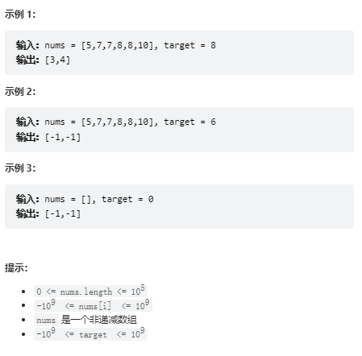

# 题目
给你一个按照非递减顺序排列的整数数组 nums，和一个目标值 target。请你找出给定目标值在数组中的开始位置和结束位置。

如果数组中不存在目标值 target，返回 [-1, -1]。

你必须设计并实现时间复杂度为 O(log n) 的算法解决此问题。


# coding
```java
class Solution {
    /**
    总体的题目思想是通过二分查找的方式
    1.找到左边界，左边的目标值的位置
    2.找到右边界，右边的目标值的位置
     */
    public int[] searchRange(int[] nums, int target) {


        int leftIdx = findLeft(nums, target);
        int rightIdx = findRight(nums, target);

        return new int[]{leftIdx,rightIdx};  
    }

    public int findRight(int[] nums, int target){
        int left = 0;
        int right = nums.length - 1;    
        while(left <= right){
            int mid = left + (right - left) / 2;
            if(target > nums[mid]){
                left =mid + 1;

            }else if(target < nums[mid]){
                right = mid - 1;

            }else{
                // 为了清楚的表明我的代码逻辑，所以写出来。这里我们是不return，但是我的目的是需要跳出循环（目的是让右边的大于目标值）
                // 动左边就完事了（这里的理解和下面的判断场景我们都可以换图干一些）
                /*为什么移动右指针，看总结里面的注意*/
                left =mid + 1;
            }
        }
        // 判断返回哪个值
        if(right < nums.length && right >=0 && nums[right] == target){
            return right;
        }
        if(left < nums.length && left >=0 && nums[left] == target){
            return left;
        }
        return -1;

    }

    /**
    左边界的左边的值一定是小于目标值的
     */
    public int findLeft(int[] nums, int target){
        int left = 0;
        int right = nums.length - 1;    
        while(left <= right){
            int mid = left + (right - left) / 2;
            if(target > nums[mid]){      
                left =mid + 1;
            }else if(target < nums[mid]){
                // 画图可知，最后还是会移动回来得将左指针
                right = mid - 1;
            }else{
                // 为了清楚的表明我的代码逻辑，所以写出来。这里我们是不return，但是我的目的是需要跳出循环(同时的目的是让左边的小于目标值)
                // 动右边就完事
                /*为什么移动右指针，看总结里面的注意*/
                right = mid - 1;
            }
        }
        // 判断返回哪个值
        if(right < nums.length && right >=0 && nums[right] == target){
            return right;
        }
        if(left < nums.length && left >=0 && nums[left] == target){
            return left;
        }
        return -1;
    }
      
}
```

# 总结
1. 这题总的来说还是考的是二分法
2. 难点如下
   1. 传统的二分只能找到值，无法判断值是在边界，最简单的这里就用线性的方法去试探，但是就不能复合时间复杂度了
   2. 那我们就可以使用二分法来分别求取左边界和右边界
   3. 对于左边界，右边的值一定大于目标值
   4. 对于右边界，左边的值一定小于目标值
3. 就可分别判断左右边界来获取下标位置

<font color="red">注意：还有一个点非常得重要，找左边界的时候左指针千万别动，动右指针就行；因为你只有靠近左边才有可能找到左指针,所以要移动的是右指针才ok</font>

