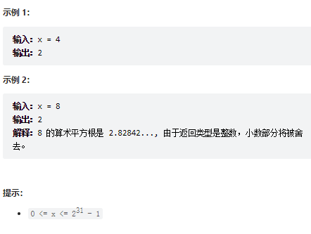

# 题目
给你一个非负整数 x ，计算并返回 x 的 算术平方根 。

由于返回类型是整数，结果只保留 整数部分 ，小数部分将被 舍去 。

注意：不允许使用任何内置指数函数和算符，例如 pow(x, 0.5) 或者 x ** 0.5 。

 




# coding
```java
class Solution {
    /**
        使用二分查找    
     */
    public int mySqrt(int x) {
        int left = 0;
        int right = x;
        int ans = -1;
        while(left <= right){
            int mid = left + (right - left) / 2;
            // 这里一定要long 相乘得溢出得风险极高
            if((long)mid * mid <= x){
                ans = mid;
                left = mid + 1;
                // 他不需要不停得移动，因为小于得时候不一定ok，要想着不停得缩小这个范围
                // return ans;
            }else{
                right = mid - 1;
            }
        }
        return ans;
    }
}
```

# 总结
1. 这题是比较经典的二分查询
2. 因为我们的值是小数的时候我们需要截取整数，所以我们要不断的移动指针，直到两个指针相等才停止

