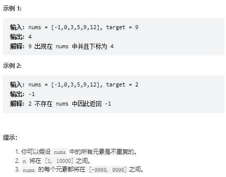

# 题目 704. 二分查找
给定一个 n 个元素有序的（升序）整型数组 nums 和一个目标值 target  ，写一个函数搜索 nums 中的 target，如果目标值存在返回下标，否则返回 -1。




# coding
```java
class Solution {
    /**二分查找 (左闭右闭更好理解)
        左闭右闭：是指刚好取到集合的做下标和右下标
        1. 左闭右闭，终止条件可以取到相等
        2. 左边右边，在移动左右指针的时候要多一位少一位
    */
    public int search(int[] nums, int target) {
        int left = 0;
        int right = nums.length - 1;
        while(left <= right){
            // 防止left 和 right 太大时int溢出
           int mid = left + (right - left) / 2;
            if(nums[mid] < target){
                // 说明在右边
                left = mid + 1;
            }
            if(nums[mid] > target){
                // 说明在左边
                right = mid - 1;
            }
            if(nums[mid] == target){
                return mid;
            }
        }
        return -1;
    }
}
```

# 总结
1. 一般使用左闭右闭的方式进行二分
2. 所以对于左闭右闭的解法我们要注意的点如下：
- right = length - 1
- 循环结束条件<=
3. 对于这可以使用二分查找的题目我们一般使用的都是对有序的数组集合进行操作。

>温故知新：
二分查找 (左闭右闭更好理解)
        左闭右闭：是指刚好取到集合的做下标和右下标
        1. 左闭右闭，终止条件可以取到相等
        2. 左边右边，在移动左右指针的时候要多一位少一位