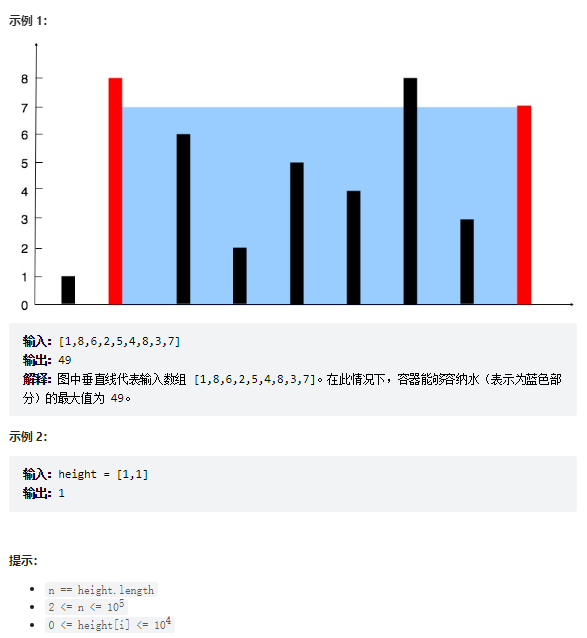

# 题目
给定一个长度为 n 的整数数组 height 。有 n 条垂线，第 i 条线的两个端点是 (i, 0) 和 (i, height[i]) 。

找出其中的两条线，使得它们与 x 轴共同构成的容器可以容纳最多的水。

返回容器可以储存的最大水量。

说明：你不能倾斜容器。



# coding
```java
class Solution {
    /**
        使用双指针
     */
    public int maxArea(int[] height) {
        int ans = 0;
        int left = 0;
        int right = height.length - 1;
        // 取到=容量为0不行
        while(left < right){
            // 取最大值（宽*决定容量的是短的模板）
            ans = Math.max(ans, (right - left) * (Math.min(height[left], height[right])));
            // 对应其中一个指针短的可以进行移动，继续去试探
            if(height[right] < height[left]){
                right --;
            }else{
                left ++;
            }
        }
        return ans;
    }
}
```

- 方法二：展开Math.max
```java
class Solution {
    /**
    使用头尾双指针
    
     */
    public int maxArea(int[] height) {
        int i = 0;
        int j = height.length - 1;
        int maxArea = Integer.MIN_VALUE;
        while(i < j){
            int boot = j - i;
            // 取短板
            int a = height[i];
            int b = height[j];
            int heightVal =  a < b ? a : b;
            // 计算短板决定得面积
            int area = boot * heightVal;
            maxArea = area > maxArea ? area : maxArea;
            // 移动决定作用得短板
            if(a > b){
                j --;
            }else{
                i ++;
            }
        }
        return maxArea;

    }
}
```

# 总结
1. 使用头尾双指针的思想
2. 易错难点：
   1. 取最大值时，主要影响因素是短的木板
   2. 什么时候需要移动哪个指针
      1. 我们只需要判断哪个木板短就可以去移动了（因为道理也比较简单，因为我们的容量是由短模板决定的，所以我们把短的木板移动一下，试探别的就行了）
   