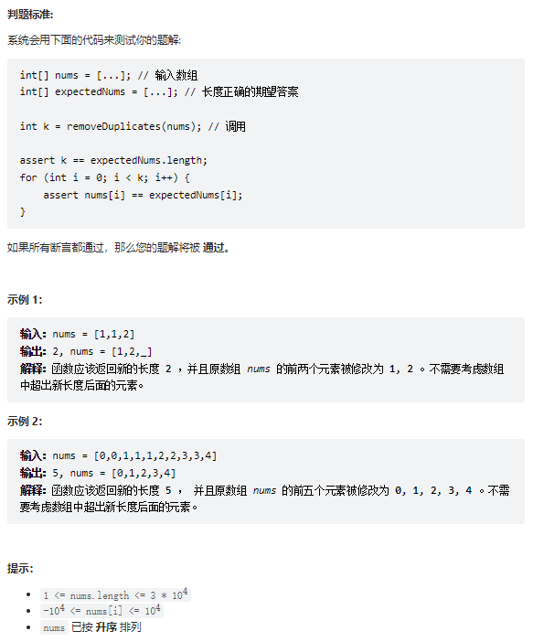

# 题目
给你一个 升序排列 的数组 nums ，请你 原地 删除重复出现的元素，使每个元素 只出现一次 ，返回删除后数组的新长度。元素的 相对顺序 应该保持 一致 。

由于在某些语言中不能改变数组的长度，所以必须将结果放在数组nums的第一部分。更规范地说，如果在删除重复项之后有 k 个元素，那么 nums 的前 k 个元素应该保存最终结果。

将最终结果插入 nums 的前 k 个位置后返回 k 。

不要使用额外的空间，你必须在 原地 修改输入数组 并在使用 O(1) 额外空间的条件下完成。




# coding
```java
class Solution {
    /**
        使用双指针
     */
    public int removeDuplicates(int[] nums) {
        if(nums.length < 2){
            return nums.length;
        }
        // 前驱指针
        int idx = 0;
        for(int i = 1; i <= nums.length - 1; i++){
            if(nums[i] != nums[idx]){
                // 因为不相等，所以将值赋值在后面即可
                idx ++;
                nums[idx] = nums[i];        
            }
        }
        // 前驱指针+1
        return idx + 1;
    }
}
```


# 总结


1. 使用双指针的方式
2. 难点：原地一趟
   1. 因为我们是排好序的，那么就是使用一个前驱指针完成对新数组的定义，然后返回idx+1就是长度，新数组的长度
   2. 前驱指针只要是和指定位置不同就可以后移