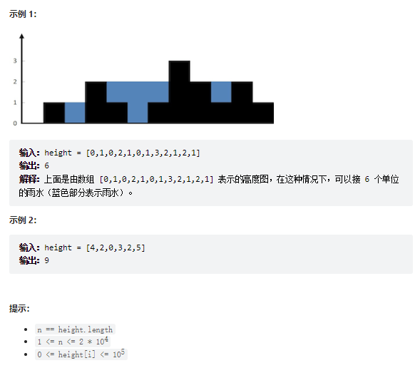

# 题目
给定 n 个非负整数表示每个宽度为 1 的柱子的高度图，计算按此排列的柱子，下雨之后能接多少雨水。



# coding
```java
class Solution {
    /**
        使用反向双指针的方式，
        1.最短模板效应
        2.记录每个点的左侧最大值和右侧最大值
        时间复杂度：O（n） 空间复杂度：O（1）
     */
    public int trap(int[] height) {
        int left = 0;
        int right = height.length - 1;
        int leftMax = 0;
        int rightMax = 0;
        int ans = 0;

        while(left < right){
            // 计算左侧最大值和右侧最大值
            leftMax = Math.max(leftMax, height[left]);
            rightMax = Math.max(rightMax, height[right]);

            if(leftMax < rightMax){
                ans += leftMax - height[left];
                left ++;
            }else{
                ans += rightMax - height[right];
                right --; 
            }
        }
        return ans;
    }
}
```


# 总结
1. 难点：思路
2. 难点
   1. 最左端和最右端时怎么计算
   2. 每段的值到底怎么来的
   3. 怎么很好的利用短板效应
   4. 根据coding去画个图，不然不好理解