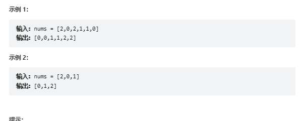

# 题目
给定一个包含红色、白色和蓝色、共 n 个元素的数组 nums ，原地对它们进行排序，使得相同颜色的元素相邻，并按照红色、白色、蓝色顺序排列。

我们使用整数 0、 1 和 2 分别表示红色、白色和蓝色。

必须在不使用库内置的 sort 函数的情况下解决这个问题。



# coding
```java
class Solution {
    // 使用三指针的方式
    public void sortColors(int[] nums) {
        int i = 0;
        int j = 0;
        int k = nums.length - 1;
        while(j <= k){
            if(nums[j] == 0){
                swap(nums,i,j);
                i++;
                // 因为判断的就是j，所以j必定是要后移的9
                j++;
            }else if(nums[j] == 2){
                swap(nums,k,j);
                k--;
                // 不知道k是多少所以不要j后移  
            }else{
                j ++;
            }
        } 
    }

    public static void swap(int[] a, int i, int j) {
		int t = a[i];
		a[i] = a[j];
		a[j] = t;
	}
}
```

# 总结
1. 我们的最好的想法是一趟排序就完成排序，这里我们使用三指针的方式
2. 三个指针分别是:
   1. 一个头指针
   2. 一个尾指针
   3. 一个遍历指针
3. 这样我们在一次遍历的时候通过遍历指针所指向的值，我们就可以判断这个值应该去后面部分还是前面部分，和头尾指针交换位置即可
4. 这里的难点
   1. 交换之后什么时候需要将遍历指针后移什么时候不用移动
   2. 和头指针交换的时候需要移动，因为我们前面都是遍历过的，所以一定当前的值是需要后移的
   3. 和尾指针交换的时候不要移动，因为我们并不知道尾指针的值是多少