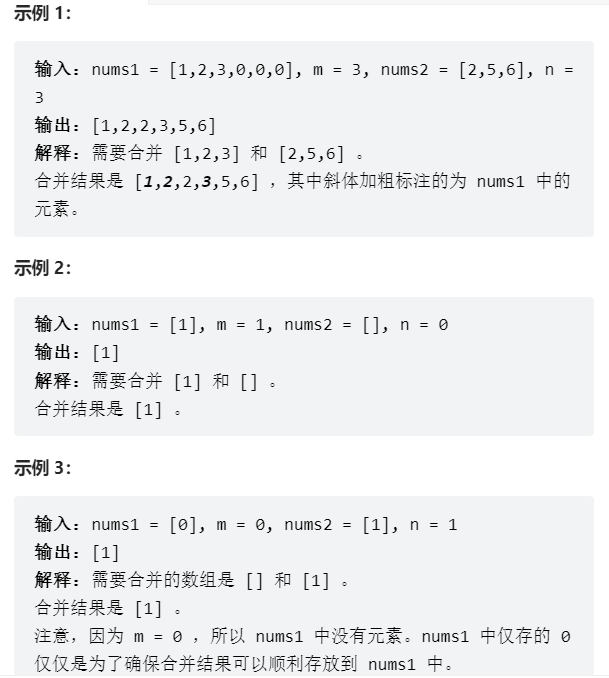
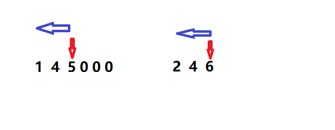

# 题目
给你两个按 非递减顺序 排列的整数数组 nums1 和 nums2，另有两个整数 m 和 n ，分别表示 nums1 和 nums2 中的元素数目。

请你 合并 nums2 到 nums1 中，使合并后的数组同样按 非递减顺序 排列。

注意：最终，合并后数组不应由函数返回，而是存储在数组 nums1 中。为了应对这种情况，nums1 的初始长度为 m + n，其中前 m 个元素表示应合并的元素，后 n 个元素为 0 ，应忽略。nums2 的长度为 n 。



# coding
```java
class Solution {
    /**
        使用双倒序指针（两个数组都使用倒叙的方式）
     */
    public void merge(int[] nums1, int m, int[] nums2, int n) {
        int idx = m + n -1;
        int i = m - 1;
        int j = n - 1;
        while(i >= 0 && j >= 0){
            // 比较的是每个数组有数的地方
            if(nums1[i] < nums2[j]){
                // 因为是非递减的，所以从后面比起一定就是大数字
                nums1[idx] = nums2[j];
                idx --;
                j --;
            }else{
                // 同上
                nums1[idx] = nums1[i];
                idx --;
                i --;
            }
        }

        // 排完之后，可能num2还有值
        while(j >= 0){
            // 因为是非递减的，如果有剩余的值直接排上就ok
            nums1[idx] = nums2[j];
            j --;
            idx --; 
        }
        
    }
}
```

# 总结
1. 这题可以使用归并排序的思想，使用双指针分别比较两个数组中的结果（`这里使用的是倒序双指针得方式，因为我们的结果需要保存在第一个数组中，为了保证我们的死一个数组不出现数据被覆盖的问题所以使用了倒序双指针`）
2. 难点在于，因为我们的条件是i >= 0 && j >= 0，所以很有可能当i遍历结束的时候，但是j还是需要继续遍历
3. 所以我们在i排完之后，需要将j对应的第二个数组重新继续遍历到结束

- 倒序指针（从有数的地方开始遍历）
- num2这个数组有可能未遍历结束，所以需要再遍历一次
