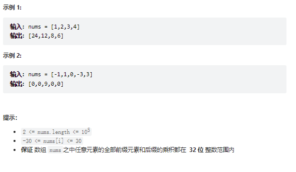
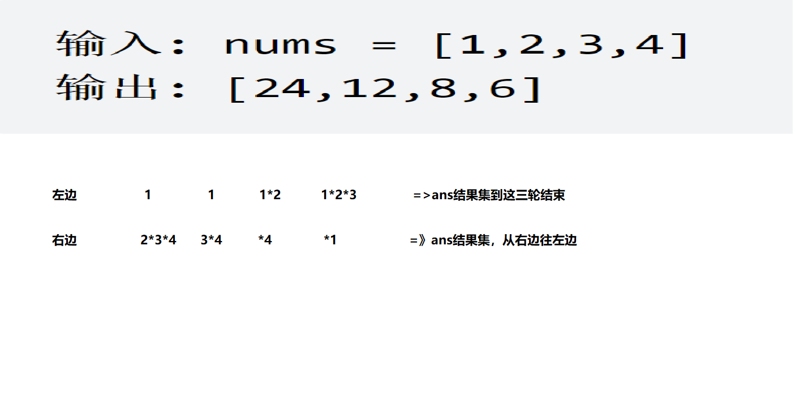

# 题目
给你一个整数数组 nums，返回 数组 answer ，其中 answer[i] 等于 nums 中除 nums[i] 之外其余各元素的乘积 。

题目数据 保证 数组 nums之中任意元素的全部前缀元素和后缀的乘积都在  32 位 整数范围内。

请不要使用除法，且在 O(n) 时间复杂度内完成此题。



# coding
```java
class Solution {
    /**
        左边乘积*右边乘积=结果
     */
    public int[] productExceptSelf(int[] nums) {
        // 结果集
        int[] ans = new int[nums.length];
        ans[0] = 1;
        // 左边集合
        for(int i = 1; i <= nums.length - 1; i++){
            ans[i] = ans[i - 1] * nums[i - 1];
        }
        // 乘以右边
        int right = 1;
        for(int i = nums.length - 1; i >=0; i--){
            ans[i] *= right;
            right *= nums[i];
        }
        return ans;

    }
}
```

# 总结
1. 定义一个结果集，ans[0] = 1
2. 然后左边乘积第一行
3. 结果集乘以右边乘积

