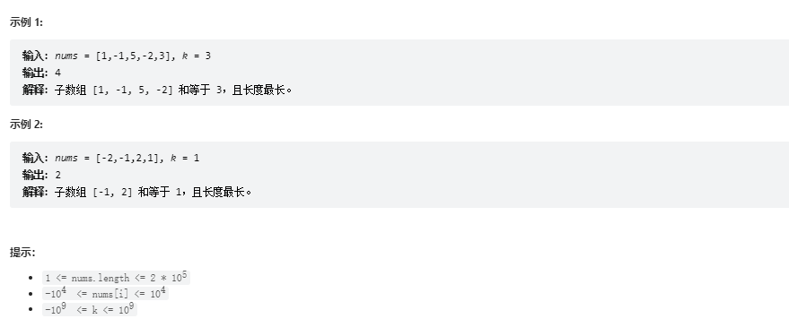
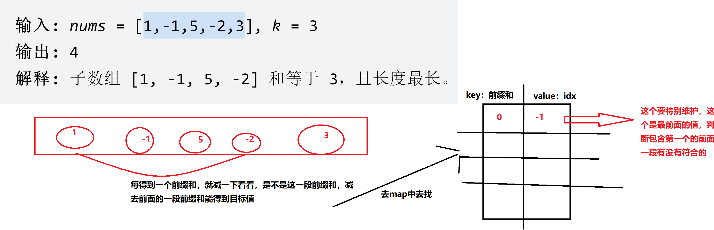

# 题目
给定一个数组 nums 和一个目标值 k，找到和等于 k 的最长连续子数组长度。如果不存在任意一个符合要求的子数组，则返回 0。

# coding

```java
 public int maxSubArrayLen(int[] nums, int k) {
        int ans = Integer.MIN_VALUE;
        int preSum = 0;
        // k-前缀和 v-下标值
        Map<Integer,Integer> preSumToIdx = new HashMap<>();
        // 因为我们要比较最前面得一段，所以要将-1得位置赋值为0
        preSumToIdx.put(0, -1);
        for(int i = 0; i <= nums.length - 1; i++){
            // 前缀和累加
            preSum += nums[i];
            // 放到map中(因为我们得题意是最长的，所以记录第一次就行了，后面再有一样得前缀和，其实对我们得结果没有影响)
            if(!preSumToIdx.containsKey(preSum)){
                preSumToIdx.put(preSum, i);
            }
            // 判断长度
            if(preSumToIdx.containsKey(preSum - k)){
                Integer idx = preSumToIdx.get(preSum - k);
                ans = Math.max(ans, i - idx);
            }
            
        }
        return ans == Integer.MIN_VALUE ? 0 : ans;
    }
```
# 总结
1. 这题要和[leetCode209.长度最小的子数组](./leetCode209.长度最小的子数组.md)滑动窗口玩法分开
2. 难点，在于理解（前缀和-目标值）这其实就可以理解
   1. 求数组其中一段是不是等于目标值（其实就是某一段前缀和-这一段前缀和之前的的前缀和=目标值）
   2. 其实就是判断（减法中减数是不是在其中）

