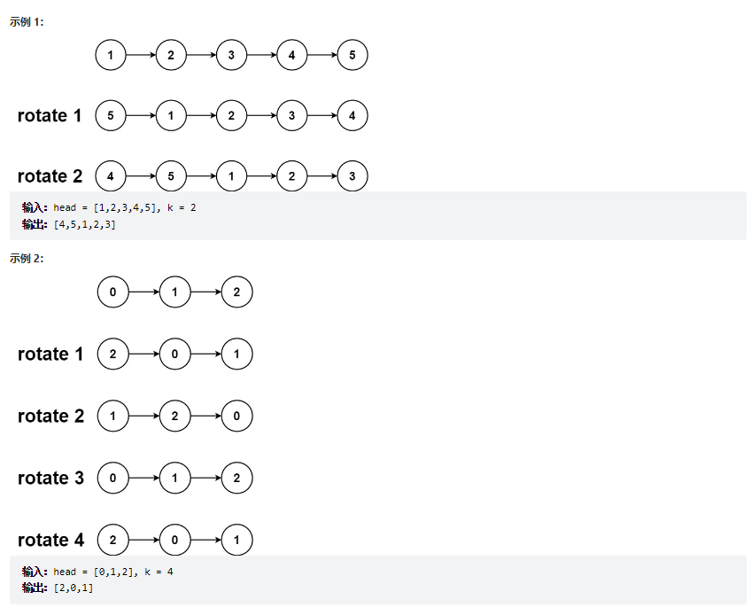
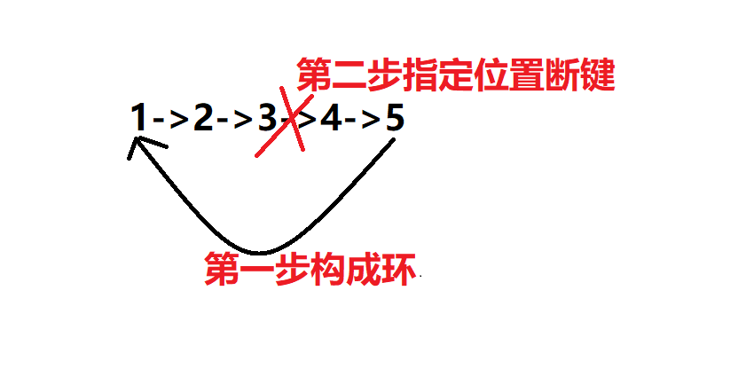

# 题目
给你一个链表的头节点 head ，旋转链表，将链表每个节点向右移动 k 个位置。


# coding
```java
/**
 * Definition for singly-linked list.
 * public class ListNode {
 *     int val;
 *     ListNode next;
 *     ListNode() {}
 *     ListNode(int val) { this.val = val; }
 *     ListNode(int val, ListNode next) { this.val = val; this.next = next; }
 * }
 */
class Solution {
    // 将头尾节点连起来成环，然后到对应的位置断开指针即可
    public ListNode rotateRight(ListNode head, int k) {
        if(head == null){
            return null;
        }
        ListNode cur = head;
        // 记录链表的长度
        int count = 1;
        // 找到最后一个
        while(cur.next != null){
            cur = cur.next;
            count ++;
        }
        // 构成环
        cur.next = head;
        // 循环到指定的点将其断开(因为k可能大于n，所以需要%)
        for(int i = 0; i < count - k % count; i++){
            cur = cur.next;
        }

        head = cur.next;
        cur.next = null; 
        return head;

    }
}
```

# 总结
1. 思路很巧妙
   1. 先将链表构成环，然后在指定的位置将键断开即可
2. 难点：
   1. 断键的位置，因为我们代码是将最后的指针指向原始链表的最后的位置，所以我们的目标是**总的链表长度-k**
   2. 由于题目中的k是会大于我们的链表长度的所以需要对**总长度取模**
3. 步骤总结图
