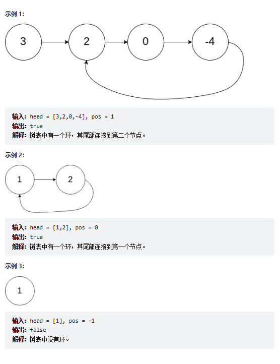

# 题目
给你一个链表的头节点 head ，判断链表中是否有环。

如果链表中有某个节点，可以通过连续跟踪 next 指针再次到达，则链表中存在环。 为了表示给定链表中的环，评测系统内部使用整数 pos 来表示链表尾连接到链表中的位置（索引从 0 开始）。注意：pos 不作为参数进行传递 。仅仅是为了标识链表的实际情况。

如果链表中存在环 ，则返回 true 。 否则，返回 false 。


# coding
```java
/**
 * Definition for singly-linked list.
 * class ListNode {
 *     int val;
 *     ListNode next;
 *     ListNode(int x) {
 *         val = x;
 *         next = null;
 *     }
 * }
 */
public class Solution {
    /**
        使用快慢指针:因为速度是不同的，在数学中的相遇问题的时候必然相遇
     */
    public boolean hasCycle(ListNode head) {
        ListNode fast = head;
        ListNode slow = head;
        while(fast != null && fast.next != null){
            // 先让指针后移
            fast = fast.next.next;
            slow = slow.next;
            // 再进行判断
            if(fast == slow){
                return true;
            }
        }
        return false;      
    }
}
```
# 总结
