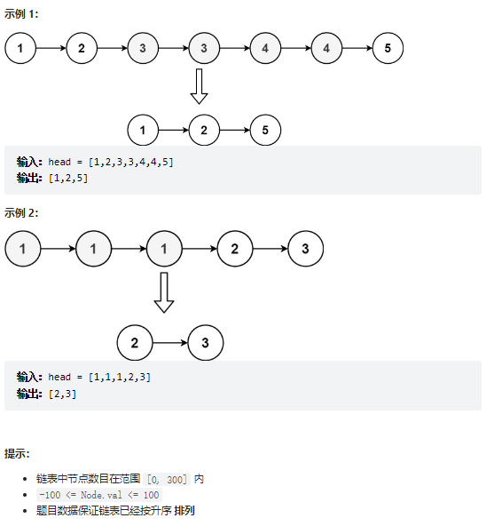

# 题目
- leetCode82. 删除排序链表中的重复元素 II
给定一个已排序的链表的头 head ， 删除原始链表中所有重复数字的节点，只留下不同的数字 。返回 已排序的链表 。


# coding
```java
/**
 * Definition for singly-linked list.
 * public class ListNode {
 *     int val;
 *     ListNode next;
 *     ListNode() {}
 *     ListNode(int val) { this.val = val; }
 *     ListNode(int val, ListNode next) { this.val = val; this.next = next; }
 * }
 */
class Solution {
    // 使用快慢同向双指针
    public ListNode deleteDuplicates(ListNode head) {
        if(head == null || head.next == null){
            return head;
        }
        ListNode dummy = new ListNode(-1000);
        dummy.next = head;
        ListNode fast = dummy.next;
        ListNode slow = dummy;
        ListNode preTemp = null;
        while(fast != null){
            if(fast.val == slow.val){
                // 不断去试探，这也是双指针滑动窗口的方法
                while(fast.val == slow.val){
                    fast = fast.next;
                    if(fast == null){
                        fast = null;
                        break;
                    }
                }
                preTemp.next = fast;
                slow = fast;
                if(fast!=null){
                   fast = fast.next;
                }
            }else{
                preTemp = slow;
                slow = fast;
                fast = fast.next;
            }
        }
        return dummy.next;
    }
}
```

# 总结
1. 虚拟头节点
2. 快慢双指针
3. 临时节点，记录上一个节点和下一个节点，**这个方法在链表中是比较常见的一种方法，便于在遍历中让指针找到下一个地址（因为在链表中当指针断开的时候就不好找到下一个地址了）**