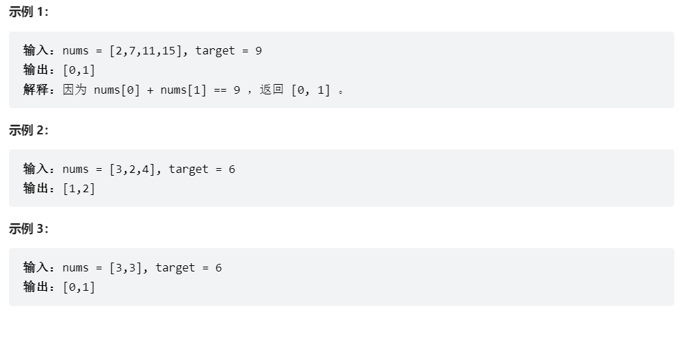

# 题目

给定一个整数数组 nums 和一个整数目标值 target，请你在该数组中找出 和为目标值 target  的那 两个 整数，并返回它们的数组下标。

你可以假设每种输入只会对应一个答案。但是，数组中同一个元素在答案里不能重复出现。

你可以按任意顺序返回答案。


# coding

```java

class Solution {
    Map<Integer, Integer> map = new HashMap<>();
    /**使用map进行缓存 */
    public int[] twoSum(int[] nums, int target) {
        for(int i = 0; i < nums.length; i++){
            map.put(nums[i], i);
        }
        for(int i = 0; i < nums.length; i++){
            int num2 = target - nums[i];
            // 下标去重
            if(map.containsKey(num2) && map.get(num2)!=i){
                return new int[]{i, map.get(num2)};
            }
        }
        return null;
    }
}

```


# 总结
1. 这题总体思路还是使用map做缓存
2. 小问题就是有题可知我们同一个下标的位置不能使用两次，所以要判断下标是不是同一个位置