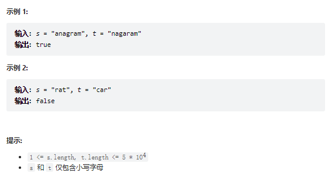

# 题目
给定两个字符串 s 和 t ，编写一个函数来判断 t 是否是 s 的字母异位词。

注意：若 s 和 t 中每个字符出现的次数都相同，则称 s 和 t 互为字母异位词。




# coding

- 我的思路：使用map
```java
class Solution {
    Map<Character, Integer> map = new HashMap<>();
    public boolean isAnagram(String s, String t) {
        // 首先判断长度
         if(s.length() != t.length()){
             return false;
         }
         // o(n+m) s用来减，t用来加，一次遍历结束
         for(int i = 0; i < s.length(); i++){
            map.put(s.charAt(i), map.getOrDefault(s.charAt(i), 0) - 1);
            map.put(t.charAt(i), map.getOrDefault(t.charAt(i), 0) + 1);
         }
         for(Integer value : map.values()){
            if(value == 0){
                continue;
            }else{
                return false;
            }
         }
         return true;
    }
}
```
- 高手的coding[高手都是用数组的^-^]
```java

 public boolean isAnagram(String s, String t) {
        int[] record = new int[26];

        for (int i = 0; i < s.length(); i++) {
            record[s.charAt(i) - 'a']++; 
        }

        for (int i = 0; i < t.length(); i++) {
            record[t.charAt(i) - 'a']--;
        }
        
        for (int count: record) {
            if (count != 0) {               // record数组如果有的元素不为零0，说明字符串s和t 一定是谁多了字符或者谁少了字符。
                return false;
            }
        }
        return true;                        // record数组所有元素都为零0，说明字符串s和t是字母异位词
    }
```

# 总结
1. 这种题目我要尽量保证一次遍历完成值的填装
2. 总体来说map就行了，简单题看coding完成可以理解