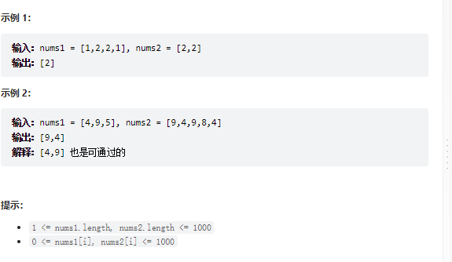

# 题目
给定两个数组 nums1 和 nums2 ，返回 它们的交集 。输出结果中的每个元素一定是 唯一 的。我们可以 不考虑输出结果的顺序 。


# coding
```java
class Solution {
    public int[] intersection(int[] nums1, int[] nums2) {
        // 使用集合即可
        Set<Integer> compareSet = new HashSet<>();
        Set<Integer> resultSet = new HashSet<>();

        for(int num : nums1){
            compareSet.add(num);
        }

        for(int num : nums2){
            if(compareSet.contains(num)){
                resultSet.add(num);
            }
        }
        // 集合转数组
        return resultSet.stream().mapToInt(x->x).toArray();

    }
}

```

# 总结
1. 使用了两个hashSet进行比较，留下结果集
2. 这也是简单题，看coding即可