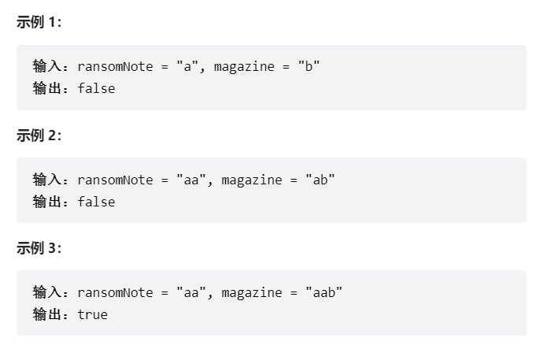

# 题目
给你两个字符串：ransomNote 和 magazine ，判断 ransomNote 能不能由 magazine 里面的字符构成。

如果可以，返回 true ；否则返回 false 。

magazine 中的每个字符只能在 ransomNote 中使用一次。




# coding
```java
class Solution {
    public boolean canConstruct(String ransomNote, String magazine) {
        // K-str;V-次数
        Map<Character, Integer> map = new HashMap<>();
        for(int i = 0; i<ransomNote.length(); i++){
            Character ch = ransomNote.charAt(i);
            map.put(ch, map.getOrDefault(ch, 0) + 1);
        }
        for(int i = 0; i<magazine.length(); i++){
            Character ch = magazine.charAt(i);
            if(map.containsKey(ch)){
                map.put(ch, map.getOrDefault(ch, 0) - 1);
            }
        }

        for(Integer count : map.values()){
            if(count > 0){
                return false;
            }
        }
        return true;
    }
}

```

# 总结

1. 将每一个值缓存到map中，然后将判断的字符串判断是不是存在
