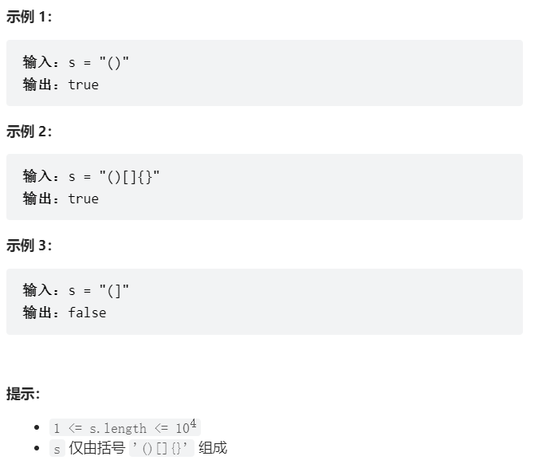
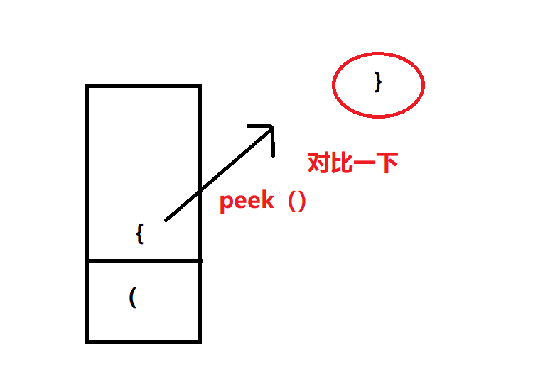

# 题目
给定一个只包括 '('，')'，'{'，'}'，'['，']' 的字符串 s ，判断字符串是否有效。

有效字符串需满足：

左括号必须用相同类型的右括号闭合。
左括号必须以正确的顺序闭合。
每个右括号都有一个对应的相同类型的左括号。



# coding
```java
class Solution {
    /**使用栈的思路来解决问题 */
    public boolean isValid(String s) {
        Stack<Character> stack = new Stack<>();
        for(int i = 0; i <= s.length() - 1; i++ ){
            Character ch = s.charAt(i);
            if(!stack.empty()){
                Character popCh = stack.peek();
                if(popCh=='(' && ch==')'){
                    stack.pop();
                    continue;
                }
                if(popCh=='[' && ch==']'){
                    stack.pop();
                    continue;
                }
                if(popCh=='{' && ch=='}'){
                    stack.pop();
                    continue;
                }
                stack.push(ch);
            }else{
                stack.push(ch);
            }
        }
        if(stack.empty()){
            return true;
        }
        return false;

    }
}

```

# 总结
1. 使用栈解决问题
2. 我遇到的小问题就是，Character在对比时使用== ；字符使用''单引号。^-^

