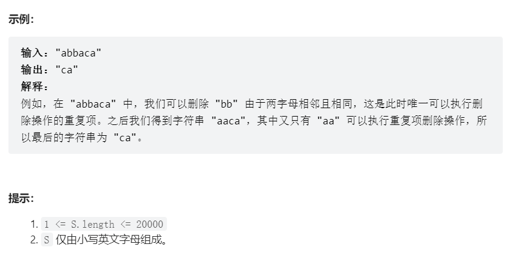

# 题目
给出由小写字母组成的字符串 S，重复项删除操作会选择两个相邻且相同的字母，并删除它们。

在 S 上反复执行重复项删除操作，直到无法继续删除。

在完成所有重复项删除操作后返回最终的字符串。答案保证唯一。



# coding

```java

class Solution {
    /**使用栈的思想（在字符串拼接的手还是需要使用队列更方便） */
    public String removeDuplicates(String s) {
        // Stack<Character> stack = new Stack<>();
        // for(int i = 0; i < s.length(); i++){
        //     Character chPeek = ' ';
        //     if(!stack.empty()){
        //         chPeek = stack.peek();
        //     }
        //     if(s.charAt(i) == chPeek){
        //         stack.pop();
        //     }else{
        //         stack.push(s.charAt(i));
        //     }
        // }
        // String res = "";
        // while(!stack.empty()){
        //     res = res + stack.pop();
        // }
        // return res;
         //ArrayDeque会比LinkedList在除了删除元素这一点外会快一点
        //参考：https://stackoverflow.com/questions/6163166/why-is-arraydeque-better-than-linkedlist
        ArrayDeque<Character> deque = new ArrayDeque<>();
        char ch;
        for (int i = 0; i < s.length(); i++) {
            ch = s.charAt(i);
            if (deque.isEmpty() || deque.peek() != ch) {
                deque.push(ch);
            } else {
                deque.pop();
            }
        }
        String str = "";
        //剩余的元素即为不重复的元素
        while (!deque.isEmpty()) {
            str = deque.pop() + str;
        }
        return str;
    }
}
```


# 总结