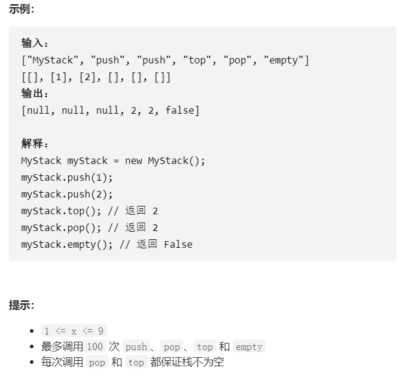

# 题目
请你仅使用两个队列实现一个后入先出（LIFO）的栈，并支持普通栈的全部四种操作（push、top、pop 和 empty）。

实现 MyStack 类：

void push(int x) 将元素 x 压入栈顶。
int pop() 移除并返回栈顶元素。
int top() 返回栈顶元素。
boolean empty() 如果栈是空的，返回 true ；否则，返回 false 。
 

注意：

你只能使用队列的基本操作 —— 也就是 push to back、peek/pop from front、size 和 is empty 这些操作。
你所使用的语言也许不支持队列。 你可以使用 list （列表）或者 deque（双端队列）来模拟一个队列 , 只要是标准的队列操作即可。



# coding

```java
class MyStack {

    Queue<Integer> queue1; // 和栈中保持一样元素的队列
    Queue<Integer> queue2; // 辅助队列

    /** Initialize your data structure here. */
    public MyStack() {
        queue1 = new LinkedList<>();
        queue2 = new LinkedList<>();
    }
    
    /** Push element x onto stack. */
    public void push(int x) {
        queue2.offer(x); // 先放在辅助队列中
        while (!queue1.isEmpty()){
            queue2.offer(queue1.poll());
        }
        Queue<Integer> queueTemp;
        queueTemp = queue1;
        queue1 = queue2;
        queue2 = queueTemp; // 最后交换queue1和queue2，将元素都放到queue1中
    }
    
    /** Removes the element on top of the stack and returns that element. */
    public int pop() {
        return queue1.poll(); // 因为queue1中的元素和栈中的保持一致，所以这个和下面两个的操作只看queue1即可
    }
    
    /** Get the top element. */
    public int top() {
        return queue1.peek();
    }
    
    /** Returns whether the stack is empty. */
    public boolean empty() {
        return queue1.isEmpty();
    }
}

```

# 总结