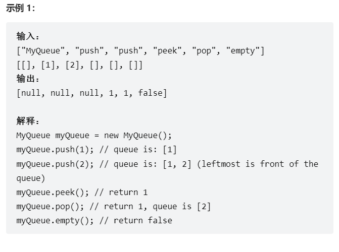
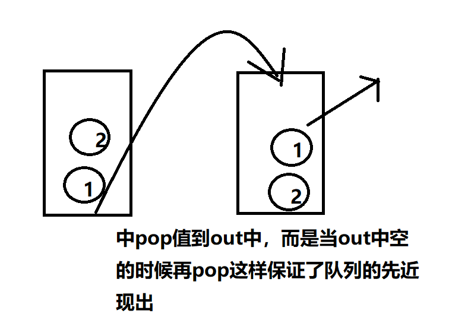

# 题目
请你仅使用两个栈实现先入先出队列。队列应当支持一般队列支持的所有操作（push、pop、peek、empty）：

实现 MyQueue 类：

void push(int x) 将元素 x 推到队列的末尾
int pop() 从队列的开头移除并返回元素
int peek() 返回队列开头的元素
boolean empty() 如果队列为空，返回 true ；否则，返回 false
说明：

你 只能 使用标准的栈操作 —— 也就是只有 push to top, peek/pop from top, size, 和 is empty 操作是合法的。
你所使用的语言也许不支持栈。你可以使用 list 或者 deque（双端队列）来模拟一个栈，只要是标准的栈操作即可。



# coding

```java

class MyQueue {
    Stack<Integer> inStack ;
    Stack<Integer> outStack;

    public MyQueue() {
        inStack = new Stack<>();
        outStack = new Stack<>();
    }
    
    public void push(int x) {
        inStack.push(x);
    }
    
    public int pop() {
        // 先判断专门输出的栈是不是空的，是空的，在输入栈的值pop到输出栈中
        if(outStack.empty()){
            while(!inStack.empty()){
                outStack.push(inStack.pop());
            }
        }
        return outStack.pop();
    }
    
    public int peek() {
        // 将结果pop出来然后再push进去
        int res = this.pop();
        outStack.push(res);
        return res;
    }
    
    public boolean empty() {
        return inStack.empty() && outStack.empty();
    }
}

/**
 * Your MyQueue object will be instantiated and called as such:
 * MyQueue obj = new MyQueue();
 * obj.push(x);
 * int param_2 = obj.pop();
 * int param_3 = obj.peek();
 * boolean param_4 = obj.empty();
 */
```

# 总结
1. 难点还是再outStack放入元素的时间<font color="red">当outStack为空的时候</font>
