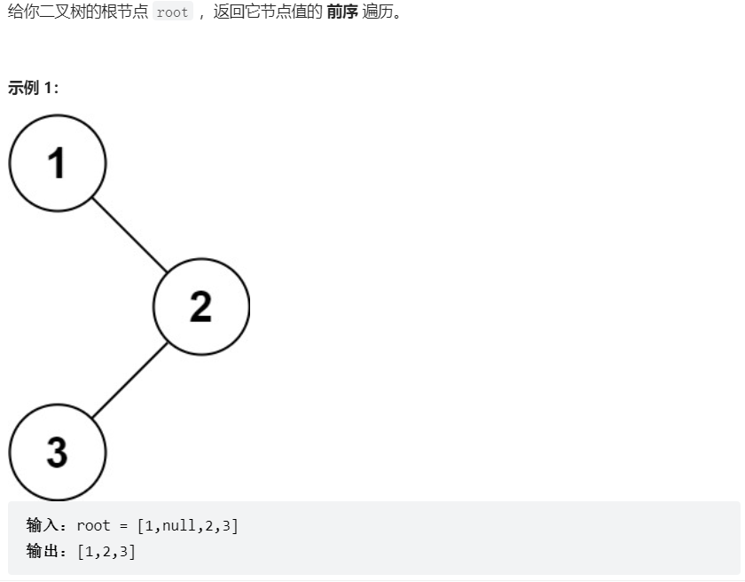
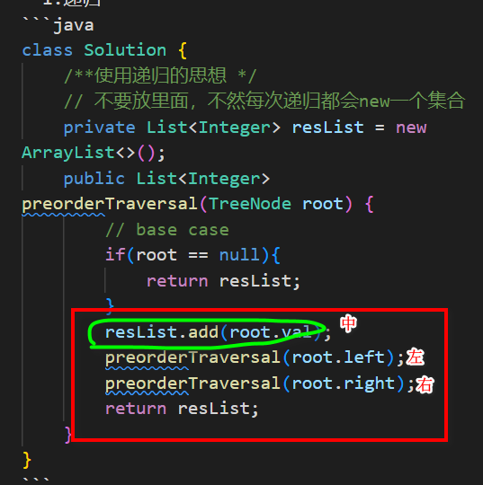
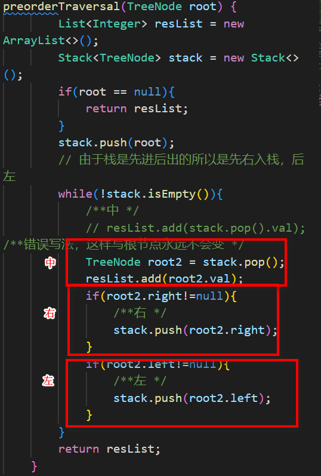
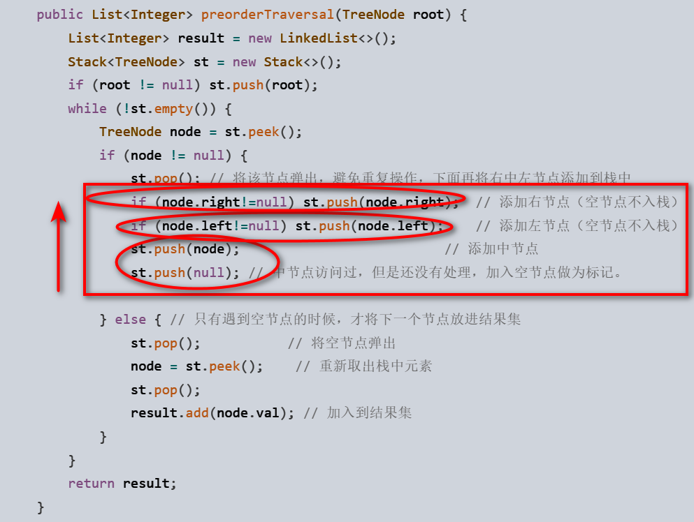

# 题目


# coding
```java
/**
 * Definition for a binary tree node.
 * public class TreeNode {
 *     int val;
 *     TreeNode left;
 *     TreeNode right;
 *     TreeNode() {}
 *     TreeNode(int val) { this.val = val; }
 *     TreeNode(int val, TreeNode left, TreeNode right) {
 *         this.val = val;
 *         this.left = left;
 *         this.right = right;
 *     }
 * }
 */
```
- 1.递归
```java
class Solution {
    /**使用递归的思想 */
    // 不要放里面，不然每次递归都会new一个集合
    private List<Integer> resList = new ArrayList<>();
    public List<Integer> preorderTraversal(TreeNode root) {   
        // base case
        if(root == null){
            return resList;
        }
        resList.add(root.val);  
        preorderTraversal(root.left);
        preorderTraversal(root.right);
        return resList;
    }
}
```
- 2迭代

```java
class Solution {
    /**使用栈完成迭代 */
    public List<Integer> preorderTraversal(TreeNode root) {   
        List<Integer> resList = new ArrayList<>();
        Stack<TreeNode> stack = new Stack<>();
        if(root == null){
            return resList;
        }
        stack.push(root);
        // 由于栈是先进后出的所以是先右入栈，后左
        while(!stack.isEmpty()){
            /**中 */
            // resList.add(stack.pop().val); /**错误写法，这样写根节点永远不会变 */
            TreeNode root2 = stack.pop();
            resList.add(root2.val);
            if(root2.right!=null){
                /**右 */
                stack.push(root2.right);
            }
            if(root2.left!=null){
                /**左 */
                stack.push(root2.left);
            }
        }
        return resList;
    }
}
```


# 总结
1. 递归
   1. 
   2. 递归最好理解，如上图所示，需要操作的节点位置和递归开始的位置有关系，本题前序遍历就是<font color="red">中左右</font>
   3. 易错点：就是递归中，返回结果不能在递归函数的内部去new，这样每次都是一个新的对象
2. 迭代
   1. 迭代其实和递归有着异曲同工的地方，总体来说我们使用的都是栈的思想
   2. 在迭代中栈的原理是FILO，所以我们在迭代入栈的时候，我们反着入栈
   3. 特别注意标识入栈顺序
   
   4. 注意一下中序遍历和后序遍历的迭代方式<font color="red">遍历结束条件+入栈顺序+是否需要初始化栈中的节点</font>
   5. 最容易记得方法，将前中后序进行统一写法.最重要的就是如下图，三个部分的交互
   