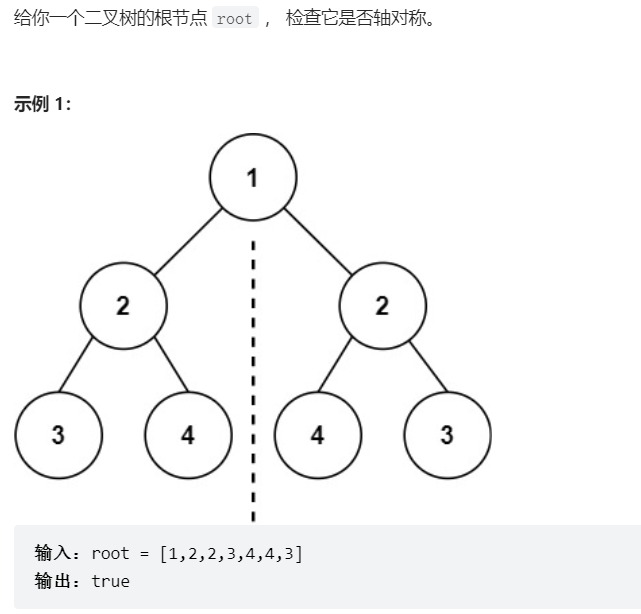

# 题目


# coding
1. 使用中序遍历的特性
```java
 List<Integer> list = new ArrayList<>();

    /**3,2,4,1,4,2,3，使用中序遍历，然后前到后相等 */
    public boolean isSymmetric(TreeNode root) {
        // base case
        if(root == null){
            return true;
        }

        isSymmetric(root.left);
        list.add(root.val);
        isSymmetric(root.right);

        return handleNode(list);
    }

    /**使用双指针判断 */
    private boolean handleNode(List<Integer> list){
        int left = 0;
        int right = list.size() - 1;
        while(left <= right){
            if(list.get(left ++) != list.get(right --)){
                return false;
            }  
        }
        return true;
    }
```

2. 完全使用递归的方式（不要思维定势，我们完全可以将两个子树分别进行同时dfs）
```java

  public boolean isSymmetric(TreeNode root) {
        return compare(root.left, root.right);
    }
    // 将子树中的左边和右边的进行比较
    private boolean compare(TreeNode left, TreeNode right) {

        if (left == null && right != null) {
            return false;
        }
        if (left != null && right == null) {
            return false;
        }

        if (left == null && right == null) {
            return true;
        }
        if (left.val != right.val) {
            return false;
        }
        // 比较外侧
        boolean compareOutside = compare(left.left, right.right);
        // 比较内侧
        boolean compareInside = compare(left.right, right.left);
        return compareOutside && compareInside;
    }
```

# 总结
1. 使用中序遍历的特点+数组
2. 完全使用递归，完全可以<font color="red">左右两个子树同时递归</font>，分别向内侧和外侧进行递归