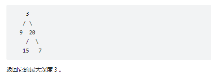
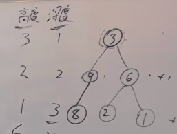
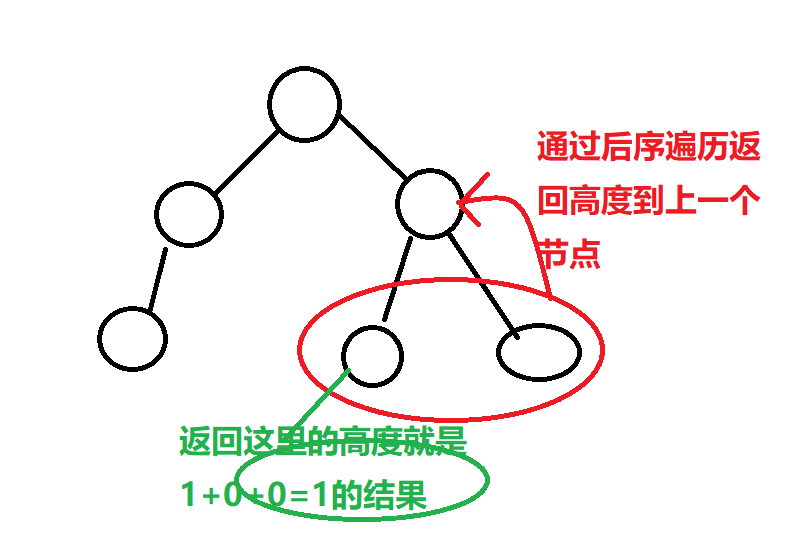

# 题目
给定一个二叉树，找出其最大深度。

二叉树的深度为根节点到最远叶子节点的最长路径上的节点数。

说明: 叶子节点是指没有子节点的节点。

示例：
给定二叉树 [3,9,20,null,null,15,7]，




# coding
```java
/**
 * Definition for a binary tree node.
 * public class TreeNode {
 *     int val;
 *     TreeNode left;
 *     TreeNode right;
 *     TreeNode() {}
 *     TreeNode(int val) { this.val = val; }
 *     TreeNode(int val, TreeNode left, TreeNode right) {
 *         this.val = val;
 *         this.left = left;
 *         this.right = right;
 *     }
 * }
 */
class Solution {
    /**使用递归：位置前序遍历 */
    private int depth = 0;;
    public int maxDepth(TreeNode root) {
        if(root == null){
            return 0;
        }
        int leftPath =  maxDepth(root.left);
        int rightPath =  maxDepth(root.right);
        // 后序遍历将每一次的高度返回给上一个节点
        int depth = 1 + Math.max(leftPath,rightPath);
        return depth;
    }
}
```

# 总结
1. 难度在于理解：返回左子树和右子树的高度，然后在后序遍历的时候计算每个节点的高度即可

深度和高度不一样的地方


