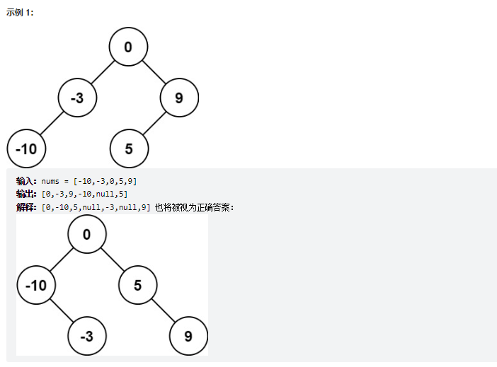

# 题目
给你一个整数数组 nums ，其中元素已经按 升序 排列，请你将其转换为一棵 高度平衡 二叉搜索树。

高度平衡 二叉树是一棵满足「每个节点的左右两个子树的高度差的绝对值不超过 1 」的二叉树。




# coding
```java
/**
 * Definition for a binary tree node.
 * public class TreeNode {
 *     int val;
 *     TreeNode left;
 *     TreeNode right;
 *     TreeNode() {}
 *     TreeNode(int val) { this.val = val; }
 *     TreeNode(int val, TreeNode left, TreeNode right) {
 *         this.val = val;
 *         this.left = left;
 *         this.right = right;
 *     }
 * }
 */
class Solution {
    /**
        递归：
        1.找到中间节点
        2.左边的向左递归，构建树
        3.右边的向右递归，构建树

        使用左闭右闭
    
     */
    public TreeNode sortedArrayToBST(int[] nums) {
        return bulidTree(nums, 0, nums.length - 1);
    }


    public TreeNode bulidTree(int[] nums, int left, int right){
        if(left > right){
            return null;
        }
        int mid = left + (right - left) / 2;
        TreeNode root = new TreeNode(nums[mid]);
        root.left = bulidTree(nums, left, mid - 1);
        root.right = bulidTree(nums, mid + 1, right);
        return root;
    }
}

```


# 总结
对于构建树的想法
1. 找到根节点
2. 找到左子树和右子树
3. 左子树向左递归构建，右子树向右递归构建
