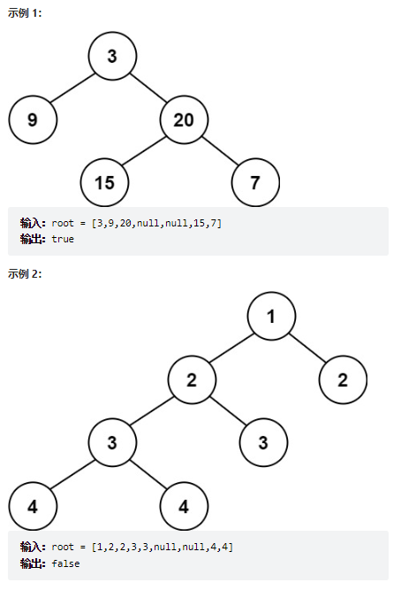
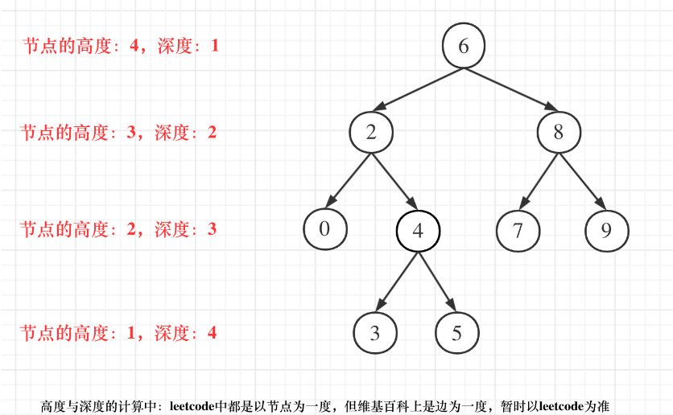
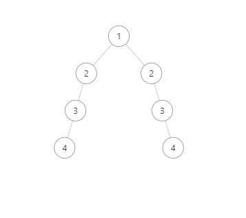

# 题目
给定一个二叉树，判断它是否是高度平衡的二叉树。

本题中，一棵高度平衡二叉树定义为：

一个二叉树每个节点 的左右两个子树的高度差的绝对值不超过 1 。

 


# coding

```java
/**
 * Definition for a binary tree node.
 * public class TreeNode {
 *     int val;
 *     TreeNode left;
 *     TreeNode right;
 *     TreeNode() {}
 *     TreeNode(int val) { this.val = val; }
 *     TreeNode(int val, TreeNode left, TreeNode right) {
 *         this.val = val;
 *         this.left = left;
 *         this.right = right;
 *     }
 * }
 */
class Solution {
    public boolean isBalanced(TreeNode root) {
        
        return getDepth(root) != -1;   
    }


    public int getDepth(TreeNode root){
        if(root == null){
            return 0;
        }
        int leftDepth = getDepth(root.left);
        // 这里就是为了避免这种情况的[1,2,2,3,null,null,3,4,null,null,4]
        if(leftDepth == -1){
            return -1;
        }
        int rightDepth = getDepth(root.right);
        // 其中一个节点已经满足了情况（特殊成链的情况）
        if(rightDepth == -1){
            return -1;
        }

        if(Math.abs(leftDepth - rightDepth) > 1){
            return -1;
        }

        int depth = 1 + Math.max(leftDepth, rightDepth);
        return depth;
    }
}
```

# 总结

1. 这题也是使用到了[leetCode104.最大深度的思想](leetCode104.%20二叉树的最大深度.md)
   
2. 判断左右子树的高度，然后取绝对值判断高度差
3. 两边成链的情况比较特殊（这样看）
   如果不加(**每次递归都不会有高度相差大于1的情况**);单纯后序遍历完成的，他判断的是第二层左右子树的差，那就是有问题了
   ```java
    // 这里就是为了避免这种情况的[1,2,2,3,null,null,3,4,null,null,4]
   if(leftDepth == -1){
        return -1;
    }

    // 其中一个节点已经满足了情况（特殊成链的情况）
    if(rightDepth == -1){
        return -1;
    }
    ```




