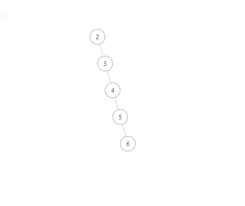
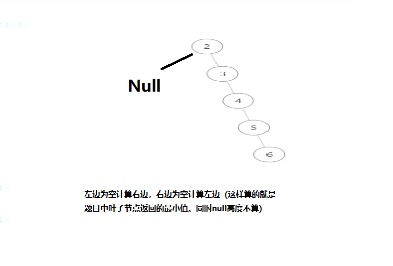

# 题目

给定一个二叉树，找出其最小深度。

最小深度是从根节点到最近叶子节点的最短路径上的节点数量。

说明：叶子节点是指没有子节点的节点。



结果返回：5

# coding

```java
/**
 * Definition for a binary tree node.
 * public class TreeNode {
 *     int val;
 *     TreeNode left;
 *     TreeNode right;
 *     TreeNode() {}
 *     TreeNode(int val) { this.val = val; }
 *     TreeNode(int val, TreeNode left, TreeNode right) {
 *         this.val = val;
 *         this.left = left;
 *         this.right = right;
 *     }
 * }
 */
class Solution {
    /**
        递归封闭计算最小的
        1.左为空加右边，
        2.右边为空加左边
     */
    public int minDepth(TreeNode root) {
        if(root == null){
            return 0;
        }
        int leftDepth = minDepth(root.left);
        int rightDepth = minDepth(root.right);
        // 1、当一个左子树为空，右不为空，这时并不是最低点（左边为空我就计算右边）
        if (root.left == null && root.right != null) {
            return rightDepth + 1;
        }
        // 2、当一个右子树为空，左不为空，这时并不是最低点（右边为空我就计算左边）
        if (root.right == null && root.left != null) {
            return leftDepth + 1;
        }
        // 如果直接假，就算上了为空的结果(误区：不要1和2直接判断这步，那造成的问题，就是null的高度还是返回了上一个节点)
        int depth = 1 + Math.min(leftDepth, rightDepth);

        return depth;


    }
}
```

# 总结
1. 图中的解释很重要



