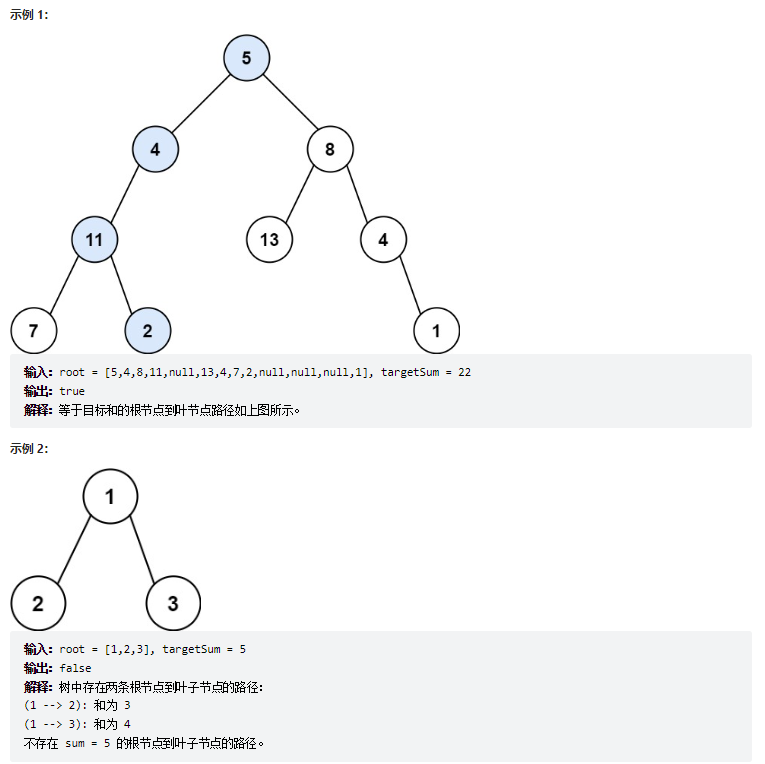

# 题目
给你二叉树的根节点 root 和一个表示目标和的整数 targetSum 。判断该树中是否存在 根节点到叶子节点 的路径，这条路径上所有节点值相加等于目标和 targetSum 。如果存在，返回 true ；否则，返回 false 。

叶子节点 是指没有子节点的节点。



# coding
```java
/**
 * Definition for a binary tree node.
 * public class TreeNode {
 *     int val;
 *     TreeNode left;
 *     TreeNode right;
 *     TreeNode() {}
 *     TreeNode(int val) { this.val = val; }
 *     TreeNode(int val, TreeNode left, TreeNode right) {
 *         this.val = val;
 *         this.left = left;
 *         this.right = right;
 *     }
 * }
 */
class Solution {
    /**回溯法 */
    public boolean hasPathSum(TreeNode root, int targetSum) {
        if(root == null){
            return false;
        }
        // 把头根节点减掉
        targetSum -= root.val;
        return travsal(root, targetSum);
    }

    public boolean travsal(TreeNode root, int targetSum){
         if(root.left == null && root.right == null && targetSum == 0){
            return true;
        }
        if(root.left == null && root.right == null){
            return false;
        }

        
        if(root.left != null){
            targetSum -= root.left.val;
            // 不需要全部判断完，有一条成立就行。如果不加if判断的就是最后一条结果
            if(travsal(root.left, targetSum)){
                return true;
            };
            targetSum += root.left.val;
        }
        if(root.right != null){
            targetSum -= root.right.val;
            if(travsal(root.right, targetSum)){
                return true;
            };
            targetSum += root.right.val;
        }
        return false;
    }


}
```

# 总结
1. 根据树结构的深度优先搜索，向下递归，通过目标值之后不断的进行递减
2. 然后通过回溯，再往目标值中加回回溯点的值


