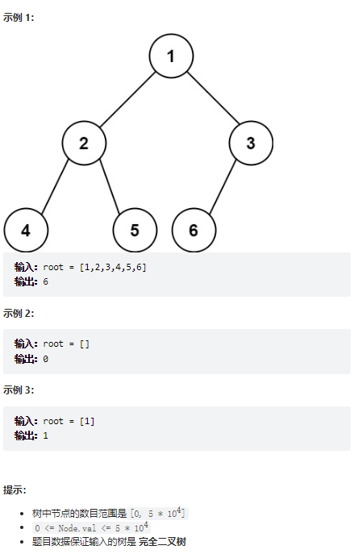

# 题目
给你一棵 完全二叉树 的根节点 root ，求出该树的节点个数。

完全二叉树 的定义如下：在完全二叉树中，除了最底层节点可能没填满外，其余每层节点数都达到最大值，并且最下面一层的节点都集中在该层最左边的若干位置。若最底层为第 h 层，则该层包含 1~ 2^h 个节点。




# coding
```java
/**
 * Definition for a binary tree node.
 * public class TreeNode {
 *     int val;
 *     TreeNode left;
 *     TreeNode right;
 *     TreeNode() {}
 *     TreeNode(int val) { this.val = val; }
 *     TreeNode(int val, TreeNode left, TreeNode right) {
 *         this.val = val;
 *         this.left = left;
 *         this.right = right;
 *     }
 * }
 */
class Solution {
    /**后序遍历 */
    public int countNodes(TreeNode root) {
        // base case,到最后的空节点返回到0
        if(root == null){
            return 0;
        }
        
        int leftNum = countNodes(root.left);
        int rightNum = countNodes(root.right);
        // 总和加一下
        int sum = 1 + leftNum + rightNum;

        return sum;


    }
}
```


# 总结
1. 这道题其实完全和[leetCode104. 二叉树的最大深度](../problem/leetCode104.%20%E4%BA%8C%E5%8F%89%E6%A0%91%E7%9A%84%E6%9C%80%E5%A4%A7%E6%B7%B1%E5%BA%A6.md)一样
2. 使用后序遍历的方式，当遍历到最后的时候将节点数返回到上一层，再做一次累加的过程即可
3. 最大深度返回上一个节点的是树的高度

