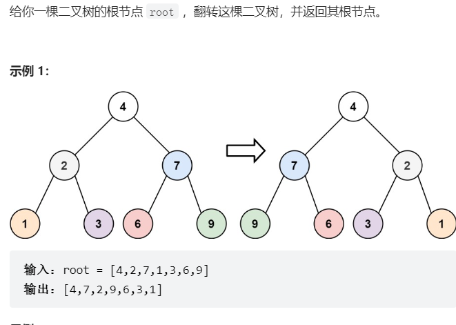

# 题目


# coding
```java
/**
 * Definition for a binary tree node.
 * public class TreeNode {
 *     int val;
 *     TreeNode left;
 *     TreeNode right;
 *     TreeNode() {}
 *     TreeNode(int val) { this.val = val; }
 *     TreeNode(int val, TreeNode left, TreeNode right) {
 *         this.val = val;
 *         this.left = left;
 *         this.right = right;
 *     }
 * }
 */
class Solution {
    /**dfs 通过前序遍历的方式完成左右孩纸的交换 */
    public TreeNode invertTree(TreeNode root) {
        // base case
        if(root == null){
            return null;
        }
        swapNode(root);
        invertTree(root.left);
        invertTree(root.right);
        return root;
    }

    public void swapNode(TreeNode root){
        TreeNode temp = root.right;
        root.right = root.left;
        root.left = temp;
    }
}
```


# 总结

1. 老实说我一开没想到解法，但看了一眼解析发现还行
2. 其实大部分树的题目我们都要尝试着从（dfs）的前、中、后几个方向进行梳理
3. 这题我的想法是在前序的地方进行交换左右孩子节点
   


