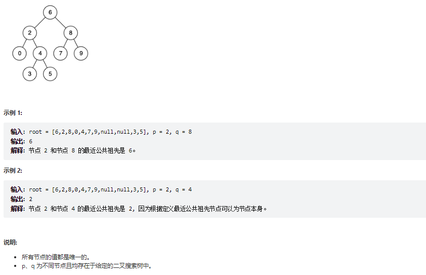

# 题目
给定一个二叉搜索树, 找到该树中两个指定节点的最近公共祖先。

百度百科中最近公共祖先的定义为：“对于有根树 T 的两个结点 p、q，最近公共祖先表示为一个结点 x，满足 x 是 p、q 的祖先且 x 的深度尽可能大（一个节点也可以是它自己的祖先）。”

例如，给定如下二叉搜索树:  root = [6,2,8,0,4,7,9,null,null,3,5]




# coding

```java
/**
 * Definition for a binary tree node.
 * public class TreeNode {
 *     int val;
 *     TreeNode left;
 *     TreeNode right;
 *     TreeNode(int x) { val = x; }
 * }
 */

class Solution {
    /**递归法 
       二叉搜索树的特点
       左小，右大
    */
    public TreeNode lowestCommonAncestor(TreeNode root, TreeNode p, TreeNode q) {
        if(root == null){
            return null;
        }
        if(root.val > p.val && root.val > q.val){
            TreeNode left = lowestCommonAncestor(root.left, p, q);
            return left;
        }
        if(root.val < p.val && root.val < q.val){
            TreeNode right = lowestCommonAncestor(root.right, p, q);
            return right;
        }
        return root;
 
    }
}

```

# 总结
1. 二叉搜索树的特点


2. 最近公共节点，只要在两个点之间就行

3. 递归中我们有时候就要有返回值的话，我们就需要定义一个返回值去接一下