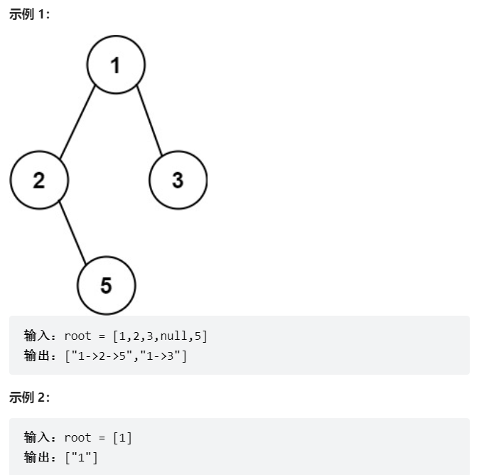
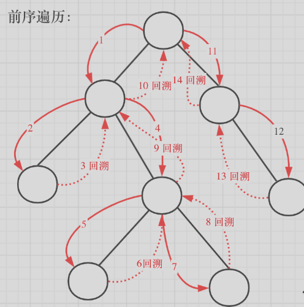

# 题目
给你一个二叉树的根节点 root ，按 任意顺序 ，返回所有从根节点到叶子节点的路径。

叶子节点 是指没有子节点的节点。




# coding

```java
/**
 * Definition for a binary tree node.
 * public class TreeNode {
 *     int val;
 *     TreeNode left;
 *     TreeNode right;
 *     TreeNode() {}
 *     TreeNode(int val) { this.val = val; }
 *     TreeNode(int val, TreeNode left, TreeNode right) {
 *         this.val = val;
 *         this.left = left;
 *         this.right = right;
 *     }
 * }
 */
class Solution {
    /**回溯 */
    public List<String> binaryTreePaths(TreeNode root) {
        List<String> res = new ArrayList<>();
        if(root == null){
            return res;
        }
        List<Integer> paths = new ArrayList<>();
        traversal(root, paths, res);
        return res;
    }

    /**
        使用回溯的方式
     */
    public void traversal(TreeNode root, List<Integer> paths, List<String> res){
        paths.add(root.val);
        // 递归结束收集结果
        if(root.right == null && root.left == null){
            // 处理每一条路径结果
            StringBuilder sb = new StringBuilder();
            
            for (int i = 0; i < paths.size() - 1; i++) {
                sb.append(paths.get(i)).append("->");
            }
            // 上面少循环一次，避免都一个箭头
            sb.append(paths.get(paths.size() - 1));
            
            res.add(sb.toString());
            return;
        }

        if(root.left != null){
            traversal(root.left, paths, res);
            // 回溯
            paths.remove(paths.size() - 1);
        }

        if(root.right != null){
            traversal(root.right, paths, res);
            // 回溯
            paths.remove(paths.size() - 1);
        }
        
    }
}

```


# 总结

1. 这题是典型的回溯法
   1. 回溯法其实就是递归的一种（回溯的精髓在于把每个收集到的结果删除，然后再重组的过程）
2. 标准的回溯模板
```java
public void traversal(TreeNode root, List<Integer> paths, List<String> res){
    // 收集结果（收集在这也行[看前序还是后序，判断收集的位置在哪方便]）


    // 处理路径中的结果


    // 收集结果（可以在这收集）


    // 递归
    // 回溯（删除路径中的最后一个然后进行重新组合）


}

```
