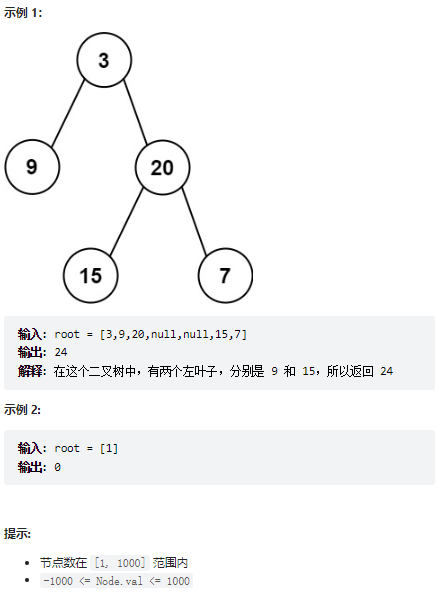
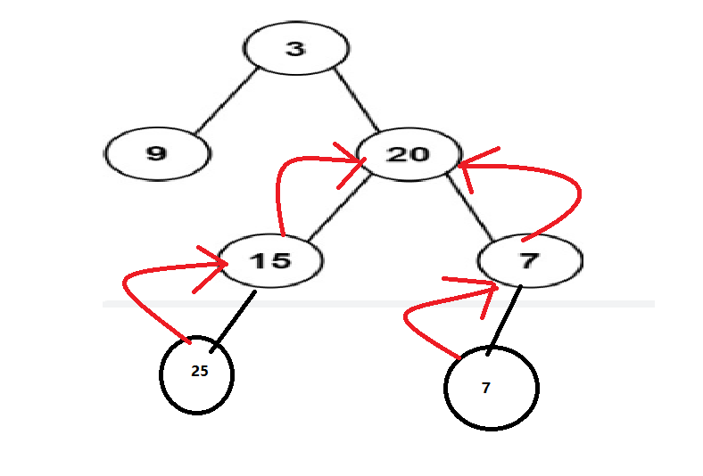
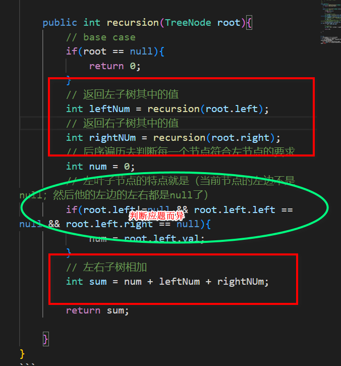

# 题目
给定二叉树的根节点 root ，返回所有左叶子之和。



# coding
```java
/**
 * Definition for a binary tree node.
 * public class TreeNode {
 *     int val;
 *     TreeNode left;
 *     TreeNode right;
 *     TreeNode() {}
 *     TreeNode(int val) { this.val = val; }
 *     TreeNode(int val, TreeNode left, TreeNode right) {
 *         this.val = val;
 *         this.left = left;
 *         this.right = right;
 *     }
 * }
 */
class Solution {
    public int sumOfLeftLeaves(TreeNode root) {
        return recursion(root);
    }

    public int recursion(TreeNode root){
        // base case
        if(root == null){
            return 0;
        }
        // 返回左子树其中的值
        int leftNum = recursion(root.left);
        // 返回右子树其中的值
        int rightNUm = recursion(root.right);
        // 后序遍历去判断每一个节点符合左节点的要求
        int num = 0;
        // 左叶子节点的特点就是（当前节点的左边不是null；然后他的左边的左右都是null了）
        if(root.left!=null && root.left.left == null && root.left.right == null){
            num = root.left.val;
        }
        // 左右子树相加
        int sum = num + leftNum + rightNUm;

        return sum;

    }
}
```


# 总结
1. 像这类的题其实递归基本都能解决
2. 我们尽量不要掉进递归的怪圈中
   1. 其实对这种题就是遍历所有的节点，然后判断是不是符合对应的左子树的要求就行
   
   <font color="red">不断的算左节点然后返回给上一个节点</font>
   2. 像题中的值需要树的值的我们基本上都是这种操作，记录返回值然后做计算(模板)
   