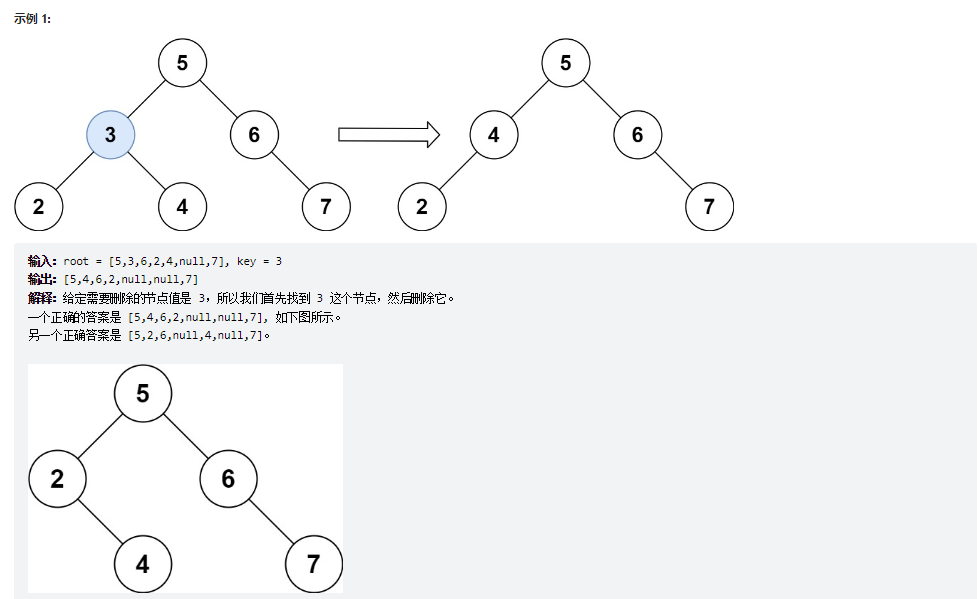
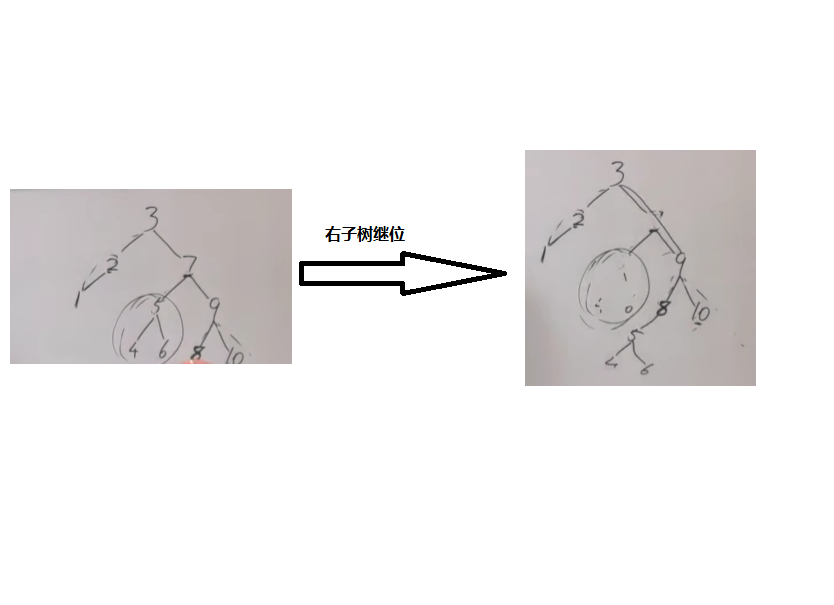

# 题目
给定一个二叉搜索树的根节点 root 和一个值 key，删除二叉搜索树中的 key 对应的节点，并保证二叉搜索树的性质不变。返回二叉搜索树（有可能被更新）的根节点的引用。

一般来说，删除节点可分为两个步骤：

首先找到需要删除的节点；
如果找到了，删除它。




# coding
```java
/**
 * Definition for a binary tree node.
 * public class TreeNode {
 *     int val;
 *     TreeNode left;
 *     TreeNode right;
 *     TreeNode() {}
 *     TreeNode(int val) { this.val = val; }
 *     TreeNode(int val, TreeNode left, TreeNode right) {
 *         this.val = val;
 *         this.left = left;
 *         this.right = right;
 *     }
 * }
 */
class Solution {
    public TreeNode deleteNode(TreeNode root, int key) {
        root = delNode(root, key);
        return root;
    }


    public TreeNode delNode(TreeNode root, int key){
        if(root == null){
            return null;
        }

        if(key < root.val){
            root.left = delNode(root.left, key);
        }
        if(key > root.val){
            root.right = delNode(root.right, key);   
        }

        if(key == root.val){
            if (root.left == null) return root.right;
            if (root.right == null) return root.left;
            // 左右都不空的情况
            TreeNode tmp = root.right;
            while (tmp.left != null) {
                tmp = tmp.left;
            }
            root.val = tmp.val;
            // 返回结果
            root.right = delNode(root.right,tmp.val);
        }

        return root;

        
    }
}

```


# 总结
