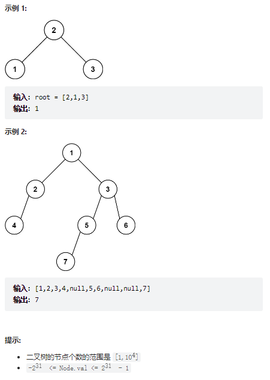
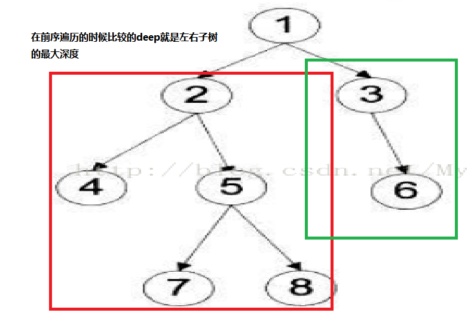

# 题目
给定一个二叉树的 根节点 root，请找出该二叉树的 最底层 最左边 节点的值。

假设二叉树中至少有一个节点。




# coding
```java
/**
 * Definition for a binary tree node.
 * public class TreeNode {
 *     int val;
 *     TreeNode left;
 *     TreeNode right;
 *     TreeNode() {}
 *     TreeNode(int val) { this.val = val; }
 *     TreeNode(int val, TreeNode left, TreeNode right) {
 *         this.val = val;
 *         this.left = left;
 *         this.right = right;
 *     }
 * }
 */
class Solution {
    /**
        最下面一层最左边的值
     */
    int DEEPTH = -1;
    int RES_VAL = 0;  
    public int findBottomLeftValue(TreeNode root) {
        RES_VAL = root.val;
        getLeftRoot(root, 0);
        return RES_VAL;
    }
    // 定义递归函数
    public void getLeftRoot(TreeNode root, int deep){
        if(root == null){
            return;
        }

        // 前序遍历：判断最左边的值
        if(root.left == null && root.right == null){
            // 到最深的地方才可能是最左的节点
            if(DEEPTH < deep){
                RES_VAL = root.val;
                DEEPTH = deep;
            }
        }

        // 左递归+左子树的深度.判断子树不为空(左子树为空的时候大部分的题目还是需要判断的)
        if(root.left != null){
            // 每次加一的都是当前左子树的深度
            getLeftRoot(root.left, deep + 1);   
        }
        // 右递归+左子树的深度
        if(root.right != null){
            getLeftRoot(root.right, deep + 1);
        }
    }


}
```


# 总结
1. 这题的意思是最底层最左边的节点（这里其实有两个点很明了）
   1. 最底层
   2. 最左边
2. 使用前序遍历，每次都是判断第一个根节点。那么这样就判断的就是最底层最左边的节点了
   


