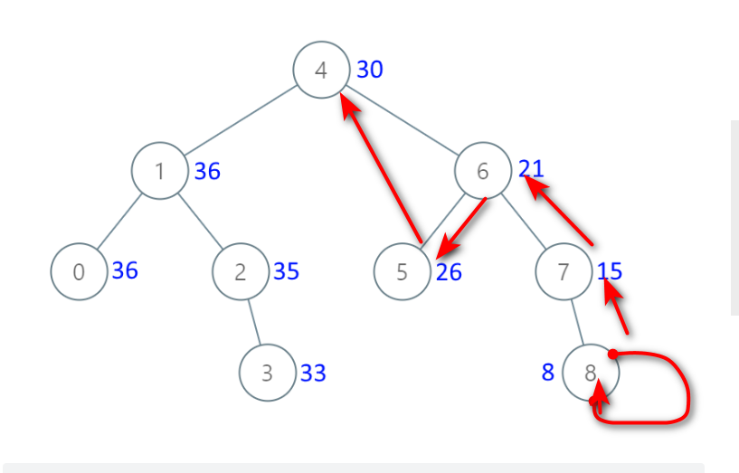

# 题目

给出二叉 搜索 树的根节点，该树的节点值各不相同，请你将其转换为累加树（Greater Sum Tree），使每个节点 node 的新值等于原树中大于或等于 node.val 的值之和。

提醒一下，二叉搜索树满足下列约束条件：

节点的左子树仅包含键 小于 节点键的节点。
节点的右子树仅包含键 大于 节点键的节点。
左右子树也必须是二叉搜索树。
注意：本题和 1038: https://leetcode-cn.com/problems/binary-search-tree-to-greater-sum-tree/ 相同




# coding

```java
/**
 * Definition for a binary tree node.
 * public class TreeNode {
 *     int val;
 *     TreeNode left;
 *     TreeNode right;
 *     TreeNode() {}
 *     TreeNode(int val) { this.val = val; }
 *     TreeNode(int val, TreeNode left, TreeNode right) {
 *         this.val = val;
 *         this.left = left;
 *         this.right = right;
 *     }
 * }
 */
class Solution {
    /**
        递归：
        从右下方向上，再向左遍历
     */
     // 全局变量
    int sum;

    public TreeNode convertBST(TreeNode root) {
        sum = 0;
        sumRoot(root);
        return root;
    }


    public void sumRoot(TreeNode root){
        if(root == null){
            return;
        }
        // 正常情况下我们都是先递归左子树的，来操作的本题通过遍历右边开始
        sumRoot(root.right);
        sum += root.val;
        root.val = sum;
        sumRoot(root.left);
 
    }
}

```

# 总结

1. 区别树递归的常规方法
   1. 先左子树
   2. 后右子树
2. 全局变量的使用
   1. 如果使用局部变量，在每次递归的话，那么每次栈中都会有一个sum，那么相加的值不准确