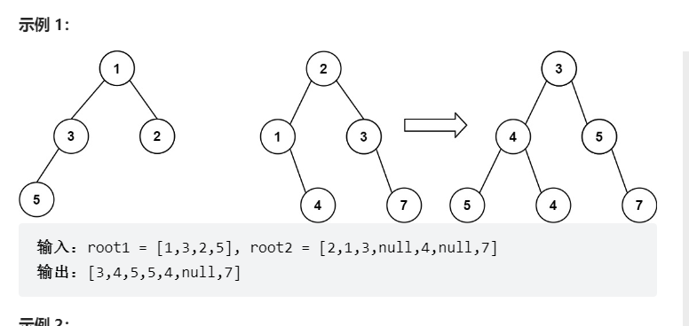

# 题目
给你两棵二叉树： root1 和 root2 。

想象一下，当你将其中一棵覆盖到另一棵之上时，两棵树上的一些节点将会重叠（而另一些不会）。你需要将这两棵树合并成一棵新二叉树。合并的规则是：如果两个节点重叠，那么将这两个节点的值相加作为合并后节点的新值；否则，不为 null 的节点将直接作为新二叉树的节点。

返回合并后的二叉树。

注意: 合并过程必须从两个树的根节点开始。




# coding
```java
/**
 * Definition for a binary tree node.
 * public class TreeNode {
 *     int val;
 *     TreeNode left;
 *     TreeNode right;
 *     TreeNode() {}
 *     TreeNode(int val) { this.val = val; }
 *     TreeNode(int val, TreeNode left, TreeNode right) {
 *         this.val = val;
 *         this.left = left;
 *         this.right = right;
 *     }
 * }
 */
class Solution {
    /**
        使用递归
        1.同时进行深度递归

     */
    public TreeNode mergeTrees(TreeNode root1, TreeNode root2) {
        if(root1 == null){
            // 当其中一个为空就返回另一个二叉树
            return root2;
        }
        if(root2 == null){
            return root1;
        }
        // 这里我们不使用新的空间，直接使用root1的原来上去修改
        root1.val = root1.val + root2.val;

        // 1和2的左子树
        root1.left = mergeTrees(root1.left, root2.left);

        root1.right = mergeTrees(root1.right, root2.right);

        return root1;


    }
}

```


# 总结
1. 同时分别向两颗树的左子树和右子树进行递归
2. 递归结束条件
   1. 当其中是null的时候返回另一颗树，同时为null的使用返回
   