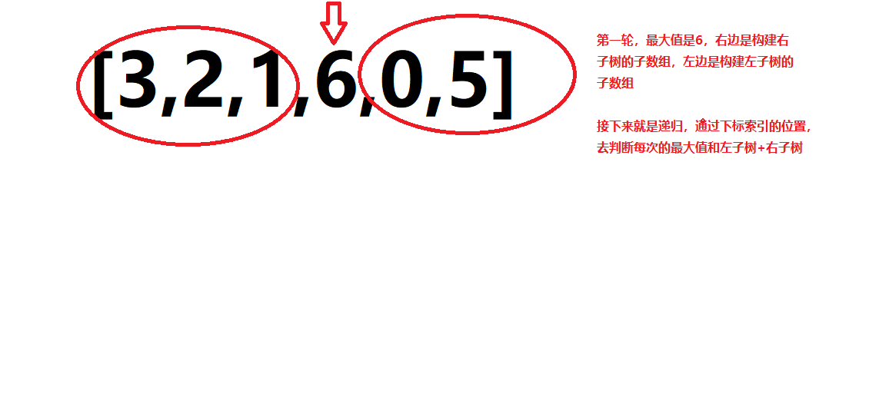

# 题目
给定一个不重复的整数数组 nums 。 最大二叉树 可以用下面的算法从 nums 递归地构建:

创建一个根节点，其值为 nums 中的最大值。
递归地在最大值 左边 的 子数组前缀上 构建左子树。
递归地在最大值 右边 的 子数组后缀上 构建右子树。
返回 nums 构建的 最大二叉树 。


# coding
```java
/**
 * Definition for a binary tree node.
 * public class TreeNode {
 *     int val;
 *     TreeNode left;
 *     TreeNode right;
 *     TreeNode() {}
 *     TreeNode(int val) { this.val = val; }
 *     TreeNode(int val, TreeNode left, TreeNode right) {
 *         this.val = val;
 *         this.left = left;
 *         this.right = right;
 *     }
 * }
 */
class Solution {
    public TreeNode constructMaximumBinaryTree(int[] nums) {
        // 空判断
        if(nums.length == 0){
            return null;
        }
        return  bulidTree(nums, 0, nums.length - 1);
    }

    // 构建树（数组/左右索引的位置）
    public TreeNode bulidTree(int[] nums, int left, int right){

        if(left > right){
            return null;
        }

        int idx = findMaxVal(nums, left, right);
        TreeNode root = new TreeNode(nums[idx]);
        // 左子树递归构建
        root.left = bulidTree(nums, left, idx - 1);
        // 右子树递归构建
        root.right = bulidTree(nums, idx + 1, right);

        return root;
    }

    // 找到最大值得索引位置
    public int findMaxVal(int[] nums, int left, int right){
        int resMax = Integer.MIN_VALUE;
        int idx = 0;
        for(int i = left; i <= right; i++){
           if(resMax < nums[i]){
               resMax = nums[i];
               idx = i;
           }
        }
        return idx;
    }
}


```


# 总结

1. 对于这题的话，其实代码思路比较好理解
2. 个人觉得难点：
   1. 想到通过索引的位置来切割子数组判断比较重要
