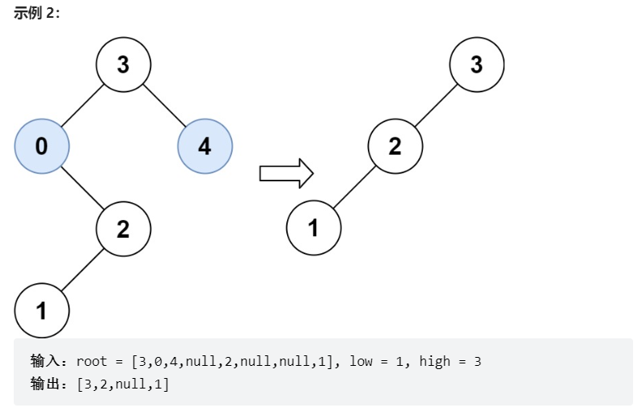

# 题目
给你二叉搜索树的根节点 root ，同时给定最小边界low 和最大边界 high。通过修剪二叉搜索树，使得所有节点的值在[low, high]中。修剪树 不应该 改变保留在树中的元素的相对结构 (即，如果没有被移除，原有的父代子代关系都应当保留)。 可以证明，存在 唯一的答案 。

所以结果应当返回修剪好的二叉搜索树的新的根节点。注意，根节点可能会根据给定的边界发生改变。




# coding
```java
/**
 * Definition for a binary tree node.
 * public class TreeNode {
 *     int val;
 *     TreeNode left;
 *     TreeNode right;
 *     TreeNode() {}
 *     TreeNode(int val) { this.val = val; }
 *     TreeNode(int val, TreeNode left, TreeNode right) {
 *         this.val = val;
 *         this.left = left;
 *         this.right = right;
 *     }
 * }
 */
class Solution {
    /**
        递归修剪(二叉搜索树的特点，左小右边大)
     */
    public TreeNode trimBST(TreeNode root, int low, int high) {
        if(root == null){
            return null;
        }
        // 范围外的话，继续向下递归
        if(root.val < low){
            // 小了就向大的一边跑
            return trimBST(root.right, low, high);
        }
        if(root.val > high){
            return trimBST(root.left, low, high);
        }
        // 在范围之内
        root.left = trimBST(root.left, low, high);
        root.right = trimBST(root.right, low, high);
        return root;


    }
}
```

# 总结
1. 代码总体的意思就是，在范围之外的就往下递归完事了
2. 范围之内的就重新赋值就好了

