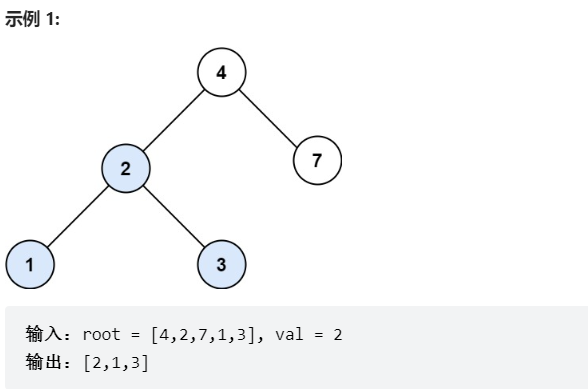
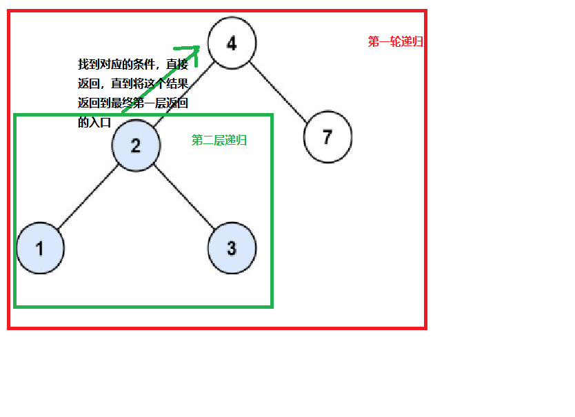

# 题目
给定二叉搜索树（BST）的根节点 root 和一个整数值 val。

你需要在 BST 中找到节点值等于 val 的节点。 返回以该节点为根的子树。 如果节点不存在，则返回 null 。




# coding
```java
/**
 * Definition for a binary tree node.
 * public class TreeNode {
 *     int val;
 *     TreeNode left;
 *     TreeNode right;
 *     TreeNode() {}
 *     TreeNode(int val) { this.val = val; }
 *     TreeNode(int val, TreeNode left, TreeNode right) {
 *         this.val = val;
 *         this.left = left;
 *         this.right = right;
 *     }
 * }
 */
class Solution {
    public TreeNode searchBST(TreeNode root, int val) {
        // 使用前序遍历
        if(root == null || root.val ==val){
            return root;
        }
        // 这是二叉树的特性,小中大
        if(root.val < val){
            // 一直将结果返回到最下面的递归入口，堆栈的最下面
            return searchBST(root.right, val);
        }else{
           return searchBST(root.left, val);        
        }
    }
}
```


# 总结
1. 将每个值返回给没一层的递归
这也是树形结构最重要的地方
