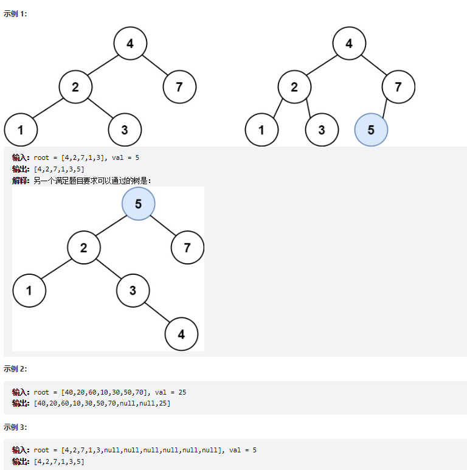
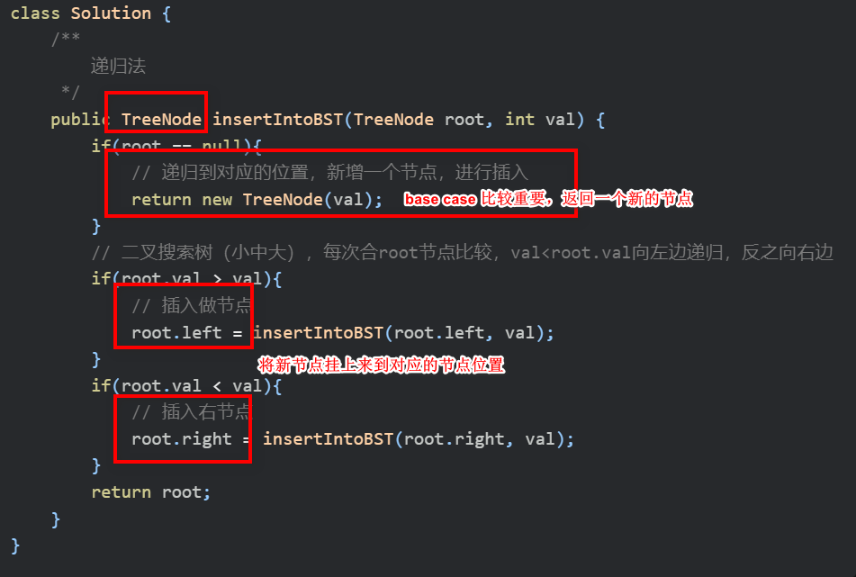

# 题目
给定二叉搜索树（BST）的根节点 root 和要插入树中的值 value ，将值插入二叉搜索树。 返回插入后二叉搜索树的根节点。 输入数据 保证 ，新值和原始二叉搜索树中的任意节点值都不同。

注意，可能存在多种有效的插入方式，只要树在插入后仍保持为二叉搜索树即可。 你可以返回 任意有效的结果 。




# coding
```java
/**
 * Definition for a binary tree node.
 * public class TreeNode {
 *     int val;
 *     TreeNode left;
 *     TreeNode right;
 *     TreeNode() {}
 *     TreeNode(int val) { this.val = val; }
 *     TreeNode(int val, TreeNode left, TreeNode right) {
 *         this.val = val;
 *         this.left = left;
 *         this.right = right;
 *     }
 * }
 */
class Solution {
    /**
        递归法
     */
    public TreeNode insertIntoBST(TreeNode root, int val) {
        if(root == null){
            // 递归到对应的位置，新增一个节点，进行插入
            return new TreeNode(val);
        }
        // 二叉搜索树（小中大），每次合root节点比较，val<root.val向左边递归，反之向右边
        if(root.val > val){
            // 插入做节点
            root.left = insertIntoBST(root.left, val);
        }
        if(root.val < val){
            // 插入右节点
            root.right = insertIntoBST(root.right, val);
        }
        return root;
    }
}
```


# 总结
1. 二叉搜索树
   1. 左边的子树小于根节点
   2. 右边的子树大于根节点
2. 由二叉树的特性我们直接比较根节点就行了
3. 

