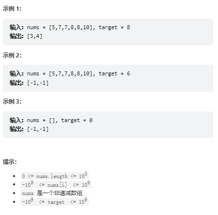

# 题目
给你一个按照非递减顺序排列的整数数组 nums，和一个目标值 target。请你找出给定目标值在数组中的开始位置和结束位置。

如果数组中不存在目标值 target，返回 [-1, -1]。

你必须设计并实现时间复杂度为 O(log n) 的算法解决此问题。


# coding
```java
class Solution {
    public int[] searchRange(int[] nums, int target) {
        if(nums.length == 0){
            return new int[]{-1,-1};  
        }

        // 二分查找左边界
        int left = findLeft(nums, target);
        // 二分查找右边界
        int right = findRight(nums, target);

        return new int[]{left,right};  
    }

    /**
        左边界，那么右边的值一定大于等于目标值；使用right指针
     */
    public int findLeft(int[] nums, int target){
        int left = 0;
        int right = nums.length - 1;
       

        while(left <= right){
            int mid = left + (right - left) / 2;
            if(nums[mid] >= target){
                    right = mid - 1;
                }else{
                    left = mid + 1;
            }
        }
        

        // 先取right
        // 以右边为主
        if(right >= 0 &&  right<nums.length &&nums[right] == target){
            return right;
        }
        if(left >= 0 && left<nums.length && nums[left] == target){
            return left;
        }
        return -1;
    }


    /**
        右边界靠左指针，左边得值<=目标值
     */
    public int findRight(int[] nums, int target){
        int left = 0;
        int right = nums.length - 1;
        while(left <= right){
            int mid = left + (right - left) / 2;
            if(nums[mid] <= target){
                left = mid + 1;
               
            }else{
              right = mid - 1;  
            }
        }
        // 以左边为主
        if(left >= 0 && left<nums.length && nums[left] == target){
            return left;
        }
        if(right >= 0 &&  right<nums.length &&nums[right] == target){
            return right;
        }
        return -1;
    }
    
}
```

# 总结
1. 这题总的来说还是考的时二分法
2. 难点如下
   1. 传统的二分只能找到值，无法判断值是在边界，最简单的这里就用线性的方法去试探，但是就不能复合时间复杂度了
   2. 那我们就可以使用二分法来分别求取左边界和有边界
   3. 对于左边界，右边的值一定大于目标值
   4. 对于右边界，左边的值一定小于目标值
3. 就可分别判断左右边界来获取下标位置

