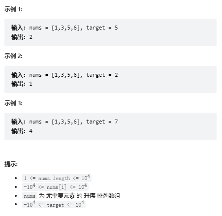

# 题目
给定一个排序数组和一个目标值，在数组中找到目标值，并返回其索引。如果目标值不存在于数组中，返回它将会被按顺序插入的位置。

请必须使用时间复杂度为 O(log n) 的算法。



# coding
```java
class Solution {
    /**
        题目有序：
        使用二分查找的方法
     */
    public int searchInsert(int[] nums, int target) {
        int left = 0;
        int right = nums.length - 1;
        while(left <= right){
            int mid = left + (right - left) / 2;
            if(nums[mid] < target){
                left = mid +1;
            }else if(nums[mid] > target){
                right = mid - 1;
            }else {
                return mid;
            }
        }
        // 由草稿推断所得，一定在右指针的右边
        return right + 1;
    }
}
```

# 总结
1. 这道题是一到标准的二分查找
2. 主要的难点就是当值不存在时需要放回我们的目标下标位置
3. 对于这个难点，我们通过草稿也不难知道，其实每次都是在右指针的右边即可
   