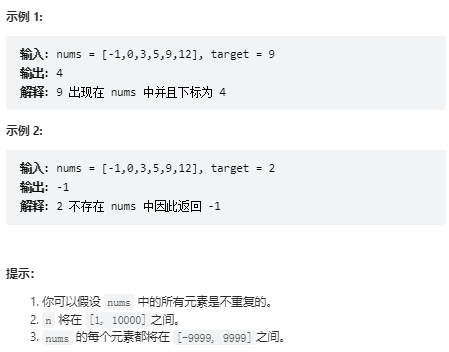

# 题目 704. 二分查找
给定一个 n 个元素有序的（升序）整型数组 nums 和一个目标值 target  ，写一个函数搜索 nums 中的 target，如果目标值存在返回下标，否则返回 -1。




# coding
```java
class Solution {
    /**
        二分查找法：排好序的
     */
    public int search(int[] nums, int target) {
        // 使用左闭右闭的思路
        int left = 0;
        int right = nums.length - 1;
        while(left <= right){
            // 防止值太大相加溢出优化
            int mid = left + (right - left) / 2;
            if(nums[mid] > target){
                right = mid - 1;
            }else if(nums[mid] < target){
                left = mid + 1;
            }else{
                return mid;
            }
        } 
        return -1;
    }
}
```

# 总结
1. 一般使用左闭右闭的方式进行二分
2. 所以对于左闭右闭的解法我们要注意的点如下：
- right = length - 1
- 循环结束条件<=
3. 对于这可以使用二分查找的题目我们一般使用的都是对有序的数组集合进行操作。