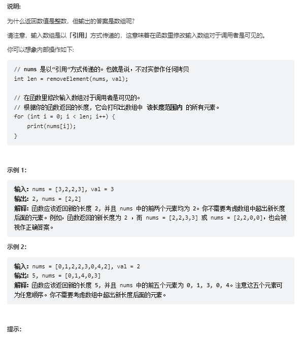

# 题目
给你一个数组 nums 和一个值 val，你需要 原地 移除所有数值等于 val 的元素，并返回移除后数组的新长度。

不要使用额外的数组空间，你必须仅使用 O(1) 额外空间并 原地 修改输入数组。

元素的顺序可以改变。你不需要考虑数组中超出新长度后面的元素。



# coding
```java
class Solution {
    /**
        双指针：
        同向指针，一个遍历指针，一个目标指针
     */
    public int removeElement(int[] nums, int val) {
        // 前驱目标指针
        int idx = 0;
        for(int i = 0; i <= nums.length - 1; i++){
            // 当遍历指针的对应的值不等于目标值时，进行覆盖，并且目标指针++（目标指针用于记录idx）
            if(nums[i] != val){
                nums[idx] = nums[i];
                idx ++;
            }
        }
        return idx;
    }
}
```

# 总结
1. 题目使用同向双指针的方式，一个前驱目标指针和一个遍历指针
2. 对两个指针的理解如下
   1. 前驱目标指针：目的时记录新数组的长度
   2. 遍历指针是判断当前位置的值和我们目标值是不是相等
3. 难点也是一次遍历，原地数组，直接覆盖目标值的方式