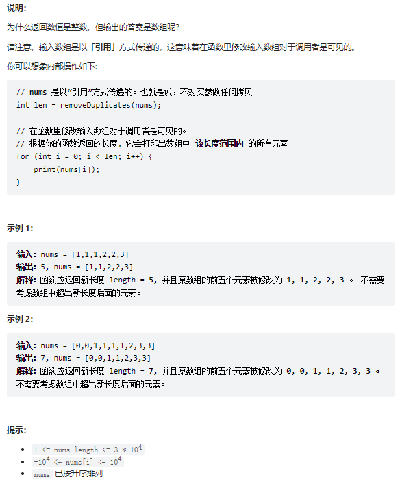
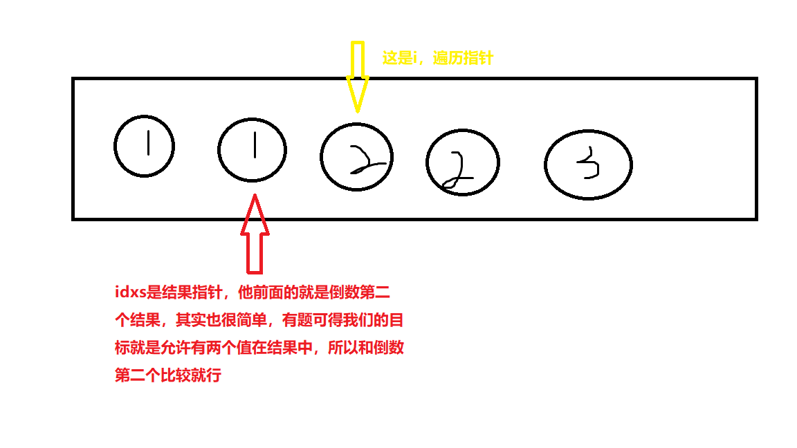

# 题目
给你一个有序数组 nums ，请你 原地 删除重复出现的元素，使得出现次数超过两次的元素只出现两次 ，返回删除后数组的新长度。

不要使用额外的数组空间，你必须在 原地 修改输入数组 并在使用 O(1) 额外空间的条件下完成。



# coding
```java
class Solution {
    /**
        使用双指针
        遍历指针+目标结果指针
        合结果数组的倒数第二个比较即可，不相等我们直接加入
     */
    public int removeDuplicates(int[] nums) {
        // 结果指针，直接跳过0，和倒数第二个比较即可
        int idx = 1;
        for(int i = 2; i < nums.length; i++){
            // 结果数组的前一个就是倒数第二个
            if(nums[i] != nums[idx - 1]){
                // 赋值到结果数组的后一个，保证结果数组中只有两个值
                idx ++;
                nums[idx] = nums[i];
            }
        }
        
        return idx + 1;
    }
}
```

# 总结

1. 这题总体和 [leetCode26.删除有序数组中的重复项](leetCode26.删除有序数组中的重复项.md)这题相似，就是题意保留结果允许两个
2. 由题可得我们得目标就是和倒数第二个比较即可
   1. 那么结果结果指针得意义尤为重要，要好好理解他位置得意义，见下图
