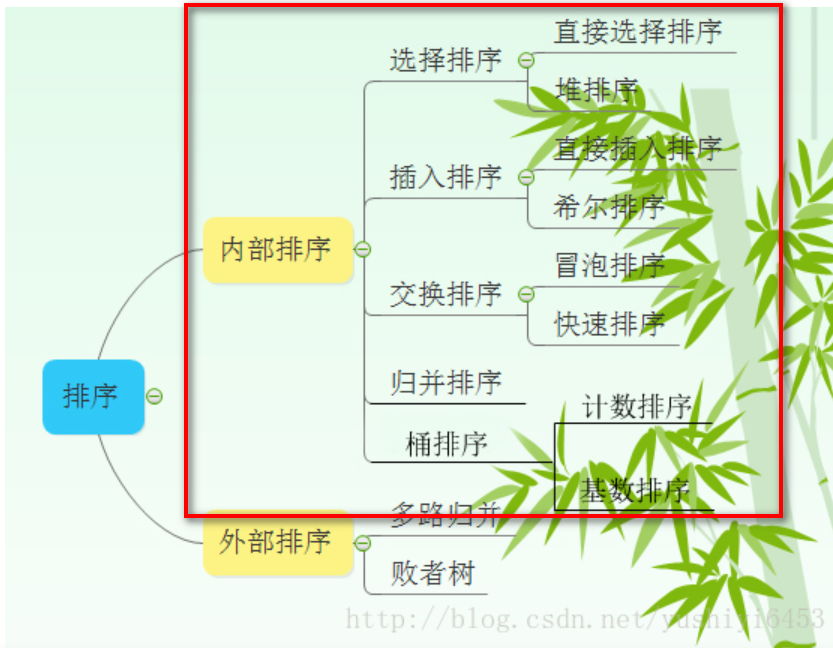
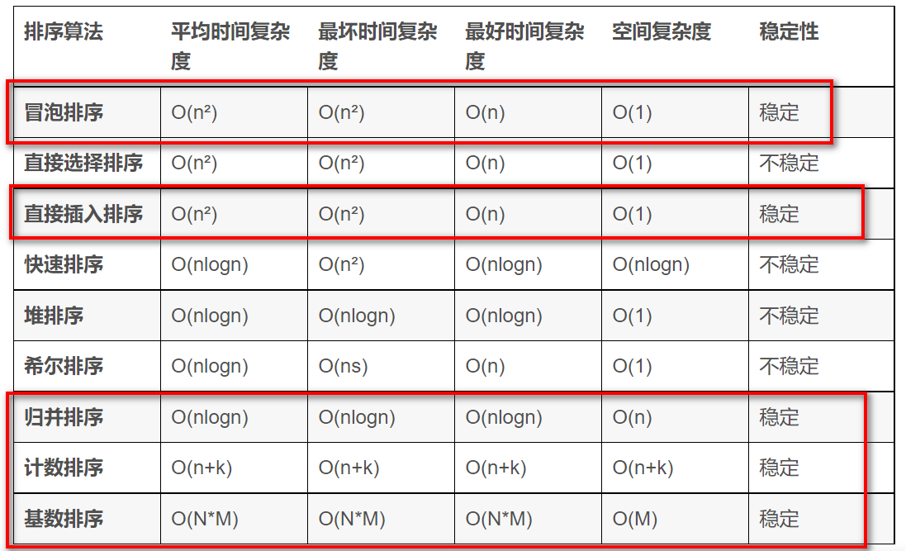

# 数组：排序
如下八大排序算法是我们必须掌握的（我框起来的）：

时间复杂度和稳定性如下：

# 经典题目

1. [leetCode88：合并两个数组](./problem/leetcode88%E5%90%88%E5%B9%B6%E4%B8%A4%E4%B8%AA%E6%9C%89%E5%BA%8F%E6%95%B0%E7%BB%84.md)
2. [leetCode75：颜色分类](./problem/leetcode75%E9%A2%9C%E8%89%B2%E5%88%86%E7%B1%BB.md)
3. [leetCode215数组中的第k个最大的元素](./problem/leetcode215数组中的第k个最大的元素.md)