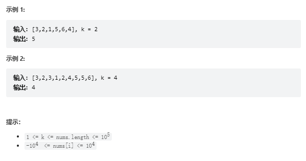

# 题目
给定整数数组 nums 和整数 k，请返回数组中第 k 个最大的元素。

请注意，你需要找的是数组排序后的第 k 个最大的元素，而不是第 k 个不同的元素。

你必须设计并实现时间复杂度为 O(n) 的算法解决此问题。



# coding
```java
class Solution {
    /**
        在不调用函数库的情况下就是手写排序算法
     */
    public int findKthLargest(int[] nums, int k) {
        Arrays.sort(nums);
        int i = nums.length - k;
        return nums[i];
    }
}
```

# 总结
1. 这里要好好玩一下排序算法
