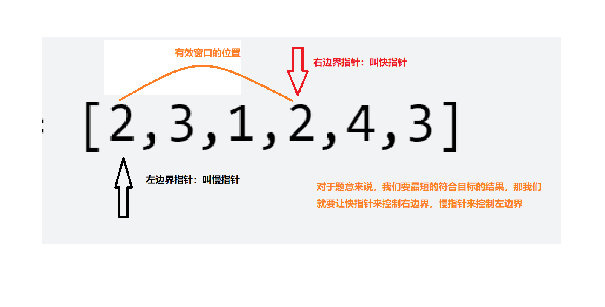

# 数组-子数组
## 滑动窗口
使用滑动窗口的解读
1. 滑动窗口其实和<font color="red">双指针</font>有异曲同工之妙
   1. 使用两个指针来控制有效窗口内的值，然后根据题意来判断条件
   2. 当快指针到**符合条件**对应的位置时，让慢指针不断的**靠近快指针**来期望获得最优解（这个过程就是缩小滑动窗口的过程）

2. 滑动窗口模板：以[leetCode209.长度最小的子数组](./problem/leetCode209.长度最小的子数组.md)为例子，看好<font color="red">for/while</font>两个循环的意义
```java
class Solution {
    /**
        滑动窗口，变相的双指针玩法
     */
    public int minSubArrayLen(int target, int[] nums) {
        // 答案值
        int ans = Integer.MAX_VALUE;
        // 左边界
        int left = 0;
        // 总和
        int sum = 0;
        // 重点一：使用for循环控制右边界【快指针】
        for(int i = 0; i <= nums.length- 1; i++){
            sum += nums[i];
            // 重点二：while 控制左边界，不断的来试探最优解法（题意满足大于等于）【慢指针】
            while(left <= i && sum >= target){
                // 结果值取最小值
                ans = Math.min(ans, i - left + 1);
                // 左指针过来就是减去总和
                sum -= nums[left];
                left ++;
            }
        }
        return ans == Integer.MAX_VALUE ? 0:ans;
    }
}
```


# 经典例题
1. [leetCode209.长度最小的子数组](./problem/leetCode209.长度最小的子数组.md)
2. [leetCode238.除自身以外数组的乘积](./problem/leetCode238.除自身以外数组的乘积.md)
3. [leetCode325.和等于k的最长子数组长度](./problem/leetCode325.%20和等于%20k%20的最长子数组长度.md)
4. [leetCode560.和为K的子数组](./problem/leetCode560.%20和为%20K%20的子数组.md)

