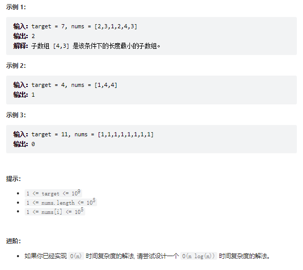

# 题目
给定一个含有 n 个正整数的数组和一个正整数 target 。

找出该数组中满足其和 ≥ target 的长度最小的 连续子数组 [numsl, numsl+1, ..., numsr-1, numsr] ，并返回其长度。如果不存在符合条件的子数组，返回 0 。




# coding

```java
class Solution {
    /**
        滑动窗口，变相的双指针玩法
     */
    public int minSubArrayLen(int target, int[] nums) {
        // 答案值
        int ans = Integer.MAX_VALUE;
        // 左边界
        int left = 0;
        // 总和
        int sum = 0;
        // 使用for循环控制右边界
        for(int i = 0; i <= nums.length- 1; i++){
            sum += nums[i];
            // while 控制左边界，不断的来试探最优解法（题意满足大于等于）
            while(left <= i && sum >= target){
                // 结果值取最小值
                ans = Math.min(ans, i - left + 1);
                // 左指针过来就是减去总和
                sum -= nums[left];
                left ++;
            }
        }
        return ans == Integer.MAX_VALUE ? 0:ans;
    }
}
```
# 总结
1. 使用滑动窗口的解读
2. 滑动窗口其实和双指针有异曲同工之妙
   1. 使用两个指针来控制有效窗口内的值，然后根据题意来判断条件
   2. 当快指针到**符合条件**对应的位置时，让慢指针不断的**靠近快指针**来期望获得最优解（这个过程就是缩小滑动窗口的过程）
